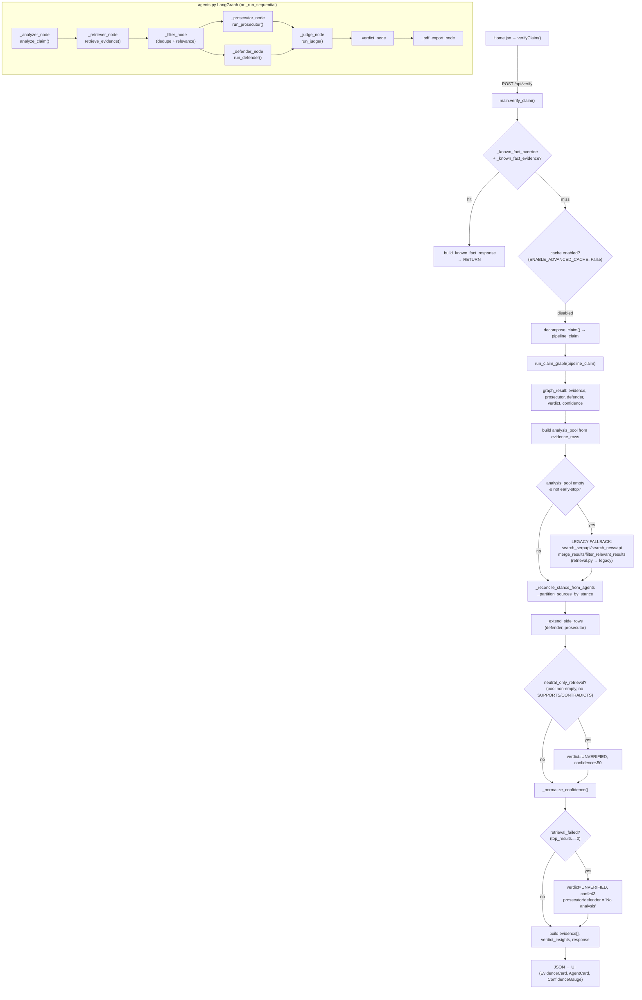

# Request Flow Dependency Graph & Root-Cause Mapping

Pre-implementation analysis. Built from the actual code (`main.py`, `agents.py`, `rag/retriever.py`, `agents/*.py`, `services/evidence_classifier.py`). No code modified to produce this.

## Rollback point (established before any changes)

- **git status**: clean working tree; `main` is 1 commit ahead of `origin/main`.
- **git branch**: `main` (current), `backup-before-langgraph`, `langgraph-stable-migration`.
- **git log -5**: `99b13f6 Pre-Tavily-retrieval-refactor backup` (HEAD) → `681d28c updating readme file` (origin/main) → `3024fe2 working and added pdf export` → `a0f8453 working` → `ea04c3e chore: integrate LangGraph RAG pipeline...`
- **Rollback refs created**:
  - git tag: `rollback-pre-tavily-refactor-20260531`
  - git branch: `rollback/pre-tavily-refactor`
  - ZIP snapshot: `../veritas-backup-pre-tavily-20260531.zip` (2.0M; excludes `.venv`, `venv`, `node_modules`, caches)
- **To restore**: `git reset --hard rollback-pre-tavily-refactor-20260531` (or `git checkout rollback/pre-tavily-refactor`), or unzip the archive.

## Complete request flow



## Active vs dormant paths (key finding)

- `retrieve_evidence()` branches on `VERITAS_USE_ADVANCED_RAG` (default `"0"`). **Active path = `retrieve_evidence_minimal()`** (SerpAPI + NewsAPI only, no FAISS). The documented FAISS hybrid path is dormant.
- `agents.py` retrieval uses `rag/retriever.py`. `main.py` keeps a **second** retrieval stack (`retrieval.py` → `legacy/retrieval.py`) used only as a fallback inside `verify_claim`. This is the duplicate stack to remove (Task 4.2).
- **Tavily**: not referenced anywhere. Only `TAVILY_API_KEY` exists. (Task 3 builds it.)

## Root-cause mapping (the four failure points)

### A. `evidenceCount` becomes 0
**Where:** `agents.py:_retriever_node` → `rag/retriever.py:retrieve_evidence_minimal` (active path), and the `analysis_pool` build in `main.verify_claim`.
**Root causes:**
1. Only SerpAPI + NewsAPI run (no Tavily). If both rate-limit/return thin results (SerpAPI free tier ~100/mo; NewsAPI ~100/day), `combined_articles` is empty → local dataset fallback → frequently empty for novel claims.
2. `_metadata_prefilter` drops sources by age (`MAX_AGE_DAYS=120`), `source_type != news`, and credibility `< 0.55` unless trusted. Comparative/historical claims ("Islam older than Hinduism") rarely return fresh "news" → dropped.
3. Rule filters (`relevance_score >= 0.05 OR keyword_score >= 0.10`) plus `_domain_match` can zero out results when the analyzer assigns the wrong domain.
**Fix (tasks 3, 4):** Tavily-first with `raw_content` and `search_depth="advanced"` materially increases recall; relax/clearly log prefilter drops; unify path so the FAISS re-rank is reachable.

### B. Prosecutor output disappears
**Where:** `agents.py:_prosecutor_node`, `agents/prosecutor.py:run_prosecutor`, and `main.py` stance partition.
**Root causes:**
1. `_prosecutor_node` returns the canned "No contradictory evidence found." whenever `evidence` is empty (cascades from A).
2. With evidence present but `VERITAS_ENABLE_LLM_AGENTS` flips, the deterministic `_deterministic_arguments` keeps only `classify_evidence == CONTRADICTS`. The keyword classifier returns **NEUTRAL** when claim-term overlap is low (`>=3 terms & overlap<2` → NEUTRAL), so a prosecutor with on-topic-but-not-lexically-matching sources gets **zero** arguments.
3. In `main.py`, `_partition_sources_by_stance` + `_extend_side_rows(side="prosecutor")` only keep rows with positive contradict margin; if everything classifies SUPPORTS/NEUTRAL, prosecutor cards are empty.
**Fix (tasks 5, 6):** Evidence Preservation Rule (≥3 items to each agent), pass full list to both agents, log `PROSECUTOR INPUT/OUTPUT`, and ensure deterministic fallback still yields content.

### C. Evidence source cards disappear
**Where:** `main.verify_claim` final `evidence[]` build from `top_results = analysis_pool[:5]`.
**Root causes:**
1. `analysis_pool` is built only from `graph_result.evidence`; if retrieval returned 0 (cause A), pool is empty → `evidence[] = []` → no cards.
2. `neutral_only_retrieval` branch keeps cards but marks UNVERIFIED; however if the legacy fallback also returns nothing, `retrieval_failed` wipes the response.
3. Frontend mapping risk: cards read `source_url`/`content`/`stance`; any key mismatch (`url` vs `source_url`) renders blank cards even when data exists.
**Fix (tasks 4, 7):** more recall (Tavily), keep evidence visible whenever retrieved, and verify exact frontend key mapping.

### D. Confidence becomes weak
**Where:** `agents/judge.py` (deterministic constants) and `main.py:_normalize_confidence`.
**Root causes:**
1. `smart_fallback` returns fixed confidences (41/44/62) and `_judge_node` clamps `50→63`, `min(36..95)`. With no/low evidence, judge yields `UNVERIFIED 38-44`.
2. `_normalize_confidence` is evidence-weighted but its inputs (`supportive_rows`, `contradictory_rows`, `rag_score`) are degraded when retrieval is thin or stance is NEUTRAL → low computed score.
3. The `neutral_only_retrieval` path caps confidence at ≤50 by design.
**Fix (task 6.2):** route all non-override verdicts through `_normalize_confidence`, feed it real evidence (fixed by A), and stop bare constants from leaking.

## Causal chain (single biggest lever)

```
Thin retrieval (A: no Tavily, aggressive prefilter)
   └─> empty/NEUTRAL evidence
        ├─> Prosecutor starved (B)
        ├─> Evidence cards empty (C)
        └─> _normalize_confidence inputs degraded → weak confidence (D)
```

**Conclusion:** A (retrieval recall) is the dominant root cause; B/C/D are largely downstream. This validates the plan order: build Tavily (Task 3) and consolidate retrieval (Task 4) first, then the mandatory checkpoint with "Is Islam older than Hinduism?" before any further work.

## Mandatory checkpoint (after Task 4 — Retrieval Consolidation)

Run claim: **"Is Islam older than Hinduism?"** Must pass ALL:
- Evidence Count > 0
- Source Cards Present
- Defender Output Present
- Prosecutor Output Present
- Judge Output Present

If any fail → STOP further tasks and investigate retrieval before proceeding. No Docker delete/rebuild until local validation passes.
