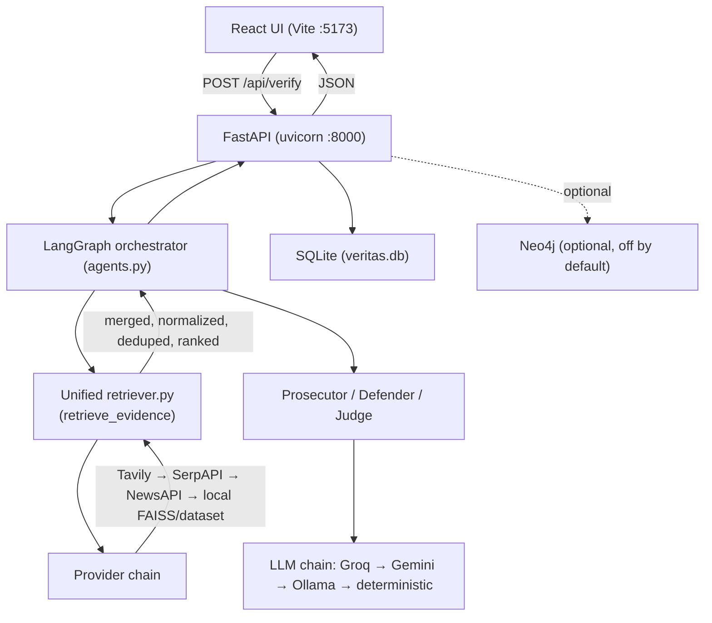

# Design Document

VeritasAI Reset, Rebuild, Fix & Validate

## Overview

This design describes how to reset, repair, and validate VeritasAI so that it runs reliably in **Local Development mode** (primary, per decision) with Docker rebuilt and validated afterward. The central technical change is consolidating evidence retrieval into a **single pipeline in `backend/rag/retriever.py`** with a **Tavily-first provider chain**, eliminating the duplicate `legacy/retrieval.py` stack that `main.py` currently uses as a fallback.

The work is grounded in a real code audit. Key facts driving the design:

- `retrieve_evidence()` branches on `VERITAS_USE_ADVANCED_RAG` (default `"0"`), so the **active path today is `retrieve_evidence_minimal()`** (SerpAPI + NewsAPI, no FAISS).
- `agents.py` calls `rag.retriever.retrieve_evidence`. `main.py` separately imports `search_serpapi/search_newsapi/...` from `retrieval.py` → `legacy/retrieval.py` and uses them as a **secondary fallback** inside `verify_claim`. This is the duplicate stack to remove.
- **No Tavily code exists anywhere.** Only the `TAVILY_API_KEY` env var is present.
- The agent layer already has the right shape: `run_prosecutor`, `run_defender`, `run_judge`, a deterministic stance fallback, and a transparent `_normalize_confidence()` in `main.py`. The reasoning chain is **Groq → Gemini → Ollama** (the README's "Gemini primary" is outdated). The fixes here are about **guaranteeing evidence reaches the agents** and **logging**, not rewriting the agents.

### Goals
1. One retrieval pipeline (`retriever.py`), Tavily-first, used by both the graph and `main.py`.
2. Evidence reliably reaches Prosecutor and Defender; Judge reliably receives both.
3. Evidence-based confidence (reuse/verify `_normalize_confidence`), no arbitrary constants leaking through.
4. Detailed, greppable retrieval + agent logs.
5. Frontend renders evidence cards, both agent analyses, confidence, stats, and PDF.
6. Local-first; Docker rebuilt and validated; no changes to unrelated containers or shared Ollama.
7. Secrets flagged for rotation; `.env` files git-ignored.

### Non-Goals
- No migration off SQLite; no Neo4j hard dependency (stays optional).
- No UI redesign — only data-mapping fixes.
- No new third retrieval stack; `legacy/` is retired, not extended.

---

## Architecture

### Target component view (Local mode)



### Provider chain (Requirement 4 decision)

Order, with graceful per-provider degradation:

1. **Tavily** (primary web search) — keyed by `TAVILY_API_KEY`
2. **SerpAPI** — existing `_search_serpapi`
3. **NewsAPI** — existing `_search_newsapi`
4. **Local fallback** — existing FAISS/local dataset (`_load_local_fallback`) and optional Neo4j read

Results from all reached providers are **merged → normalized → deduplicated → ranked** before agents see them. The chain stops early only if a provider already yields a sufficient, high-quality set (configurable threshold); otherwise it continues to enrich the candidate pool.

### Retrieval consolidation (Requirement 5 decision)

- `agents.py` continues to import `retrieve_evidence` from `rag/retriever.py` (unchanged import).
- `main.py`'s legacy fallback block (`search_serpapi/search_newsapi/merge_results/filter_relevant_results/calculate_relevance` from `retrieval.py`) is **replaced by a single call into `retriever.py`** (e.g., a `retrieve_evidence` call or a thin `retrieve_for_api()` wrapper). The `from retrieval import (...)` block in `main.py` is removed.
- `retrieval.py` and `backend/legacy/retrieval.py` are **retired** (kept only if any test imports them; otherwise the re-export shim is deleted). No new stack is introduced.
- Decision on `VERITAS_USE_ADVANCED_RAG`: standardize the **single `retrieve_evidence`** so Tavily-first runs regardless of the flag. The flag then only toggles the optional FAISS re-rank stage inside the unified path (documented), removing the silent "minimal vs advanced" divergence.

---

## Components and Interfaces

### 1. Tavily client (new) — `backend/rag/tavily_client.py`

```python
def search_tavily(query: str, top_n: int = 10, include_raw: bool = True) -> tuple[list[dict], dict]:
    """Query Tavily with raw_content enabled. Returns (normalized_articles, meta).
    Logs: 'TAVILY QUERY', 'TAVILY RESULTS COUNT', 'TAVILY SOURCES', 'TAVILY RESPONSE' (truncated).
    Degrades to ([], meta) if key missing or request fails."""
```

- Dependency: add `tavily-python` (pinned) to `requirements.txt`. Use the official client if available; otherwise fall back to a direct `httpx`/`requests` POST to the Tavily REST API (`/search`) so the integration does not hard-fail on packaging.
- Key loading: read `TAVILY_API_KEY` via `os.getenv`; expose a module-level `tavily_available` boolean. Log presence/absence at import (masked).
- **raw_content (confirmed)**: request `include_raw_content=True` and `search_depth="advanced"`. Flow per result: `raw_content → clean (_clean_text / nav-strip) → chunk (~120 words) → rank → top-k`. Keep limits reasonable to control tokens: cap `top_n` (default 10), cap stored `content`/`full_content` length (e.g., ≤1600 chars), and feed only the top-ranked chunks to agents.
- Normalization: map each Tavily result to the standard article shape used across the pipeline:
  `{title, source, content, url, source_url, published_date, credibility_score, evidence_source="tavily", source_type, full_content}` where `full_content` holds the cleaned `raw_content`.
- `credibility_score` via existing `score_source(url)`.

### 2. Unified retriever — `backend/rag/retriever.py`

- New/updated internal helper `_gather_from_providers(query, top_n)` that calls Tavily → SerpAPI → NewsAPI in order and concatenates results, with per-provider logs and counts.
- `retrieve_evidence(...)` becomes the single entrypoint:
  - query generation (existing `_understand_claim` / `_generate_query_variants`)
  - provider gather (Tavily-first) per query variant
  - merge + `_dedupe`
  - `_metadata_prefilter` + rule filters (existing), with **logging of how many each stage dropped**
  - optional FAISS hybrid re-rank (existing `_compute_article_similarity`) — gated, but the path always returns ranked evidence
  - returns `(evidence, meta)` where `meta` includes `queries`, per-provider counts (`tavily/serpapi/newsapi`), `prefilter_stats`, `filter_stats`, `retrieved_count`, `top_k`.
- A thin wrapper `retrieve_for_api(claim, ...)` may be added for `main.py` to call directly (so the API and the graph share identical retrieval), or `main.py` calls `retrieve_evidence` directly.

### 3. Evidence → agent guarantee (Requirements 5, 6) — Evidence Preservation Rule

- The graph `_filter_node` must **never starve both agents**: it enforces an explicit floor — when raw evidence exists, at least **3 items** are preserved for each agent (Defender ≥ 3, Prosecutor ≥ 3) unless retrieval itself returned fewer. When filtering would drop below the floor, keep the top‑N by relevance/rag_score and log the relaxation.
- Prosecutor and Defender each receive the **same filtered evidence list** (full list, not a pre-split). Stance partitioning for the UI happens later in `main.py` (`_partition_sources_by_stance`); the agents themselves see the full list so neither is starved.
- Judge receives `prosecutor` + `defender` results + evidence (already wired in `_judge_node`); verify both are populated before the call and log when either is empty.

### 4. Agent logging (Requirement 6)

Add explicit, greppable log lines in the agent modules / nodes:
- `DEFENDER INPUT` (claim + evidence count + sample titles), `DEFENDER OUTPUT` (arg count + strength)
- `PROSECUTOR INPUT` / `PROSECUTOR OUTPUT`
- `JUDGE INPUT` (p_strength, d_strength, evidence count) / `JUDGE OUTPUT` (verdict + confidence)

These complement the existing `[Graph]`/`[PIPELINE]` logs without changing control flow.

### 5. Confidence (Requirement 6)

- Reuse the existing transparent `_normalize_confidence()` (40% evidence quality / 20% credibility / 20% agreement / 10% quantity / 10% decisiveness, lightly blended with judge confidence). 
- Fix: ensure it is **always applied** for non-override verdicts and that the deterministic judge fallback values (e.g., constant 41/44/62) are passed through normalization rather than returned raw. Remove/ureduce the `confidence == 50 → 63` style magic where it bypasses evidence weighting.

### 6. Frontend mapping (Requirement 7)

The `/api/verify` response already provides: `evidence[]` (with `title, source, source_url, content, credibility_score, rag_score, stance`), `prosecutor`/`defender` (with `arguments`, strength), `prosecutor_points`/`defender_points`, `verdict`, `confidence`, `verdict_insights` (supporting/contradicting counts), `citations`, `history_id`, `short_id`, `pdf_export_url`.

Design tasks:
- Verify `EvidenceCard`, `AgentCard`, `ConfidenceGauge`, `VerdictBadge`, `MetricsPanel` read the exact keys above; fix any mismatches (e.g., `source_url` vs `url`, `prosecutor.arguments` vs `prosecutor_points`).
- Supporting vs contradicting split in UI uses `evidence[].stance` and/or `verdict_insights.top_supporting/top_contradicting`.
- PDF download uses existing `exportPdf(historyId)` (already has the `/api/export/pdf/{id}` → `/api/claims/history/{id}/export` fallback).
- Graceful empty states when arrays are empty (no crash).

### 7. Environment & run mode (Requirements 3, 8)

- **Local mode chosen** (justification below). `frontend/react-app/.env` → `VITE_API_BASE_URL=http://localhost:8000`. Backend reads `SECRET_KEY`, `CORS_ORIGINS`, `DATABASE_URL`, `GEMINI_API_KEY`, `GROQ_API_KEY`, `TAVILY_API_KEY`, `SERPAPI_KEY`, `NEWSAPI_KEY`, `OLLAMA_BASE_URL`, optional `NEO4J_*`.
- Env name reconciliation table (audit output): `GOOGLE_API_KEY`→`GEMINI_API_KEY`; `JWT_SECRET`→`SECRET_KEY`; `NEO4J_USERNAME`→`NEO4J_USER`; `FRONTEND_URL`→`VITE_API_BASE_URL`; `BACKEND_URL`→`CORS_ORIGINS`.
- `.env.docker` corrected so Docker validation works: add `TAVILY_API_KEY`, ensure a working reasoning provider (Groq valid, or a real `GEMINI_API_KEY` instead of `DISABLED`).
- `SECRET_KEY` placeholder replaced with a generated value for local validation; documented.

### Run mode decision (Requirement 8)

**Decision: Local development mode is primary.** Reasoning:
- The `.env.docker` is degraded (`GEMINI_API_KEY=DISABLED`, no Tavily key), so Docker would start without a usable reasoning/search config until corrected.
- The documented `.venv` is broken; local runs use system Python, which the team already uses successfully (per `HOW_TO_RUN.md`).
- Local mode gives the fastest fix→test loop for the 8 claim validations and direct log access.
- Docker is rebuilt and validated **after** local is fully green, with `.env.docker` corrected, so both modes end consistent.

---

## Data Models

Standard evidence article (internal, all providers normalize to this):

| Field | Type | Notes |
|---|---|---|
| title | str | cleaned, ≤220 chars |
| source | str | publisher or domain |
| content / snippet | str | cleaned body/snippet |
| url / source_url | str | canonical link |
| published_date | str | ISO or parsed |
| credibility_score | float 0–1 | `score_source(url)` |
| rag_score | float 0–1 | relevance/hybrid score |
| evidence_source | str | `tavily` / `serpapi_*` / `newsapi` / `local` |
| stance | str | `SUPPORTS`/`CONTRADICTS`/`NEUTRAL` (set in main.py) |

`/api/verify` evidence card (response): `{id, title, source, source_url, content, published_date, credibility_score, rag_score, evidence_source, stance}` — unchanged contract; the frontend maps to these keys.

---

## Correctness Properties

These are the executable specifications the implementation must uphold. Each maps to property-based or example-based tests in the testing strategy.

### Property 1: Provider-order invariant
For any claim, when `TAVILY_API_KEY` is set, the retrieval `meta` SHALL record that Tavily was attempted before SerpAPI and NewsAPI.

**Validates: Requirements 4.3, 4.5**

### Property 2: Graceful-degradation invariant
For any provider that raises or returns empty, `retrieve_evidence` SHALL still return a valid `(list, dict)` tuple and SHALL NOT raise.

**Validates: Requirements 4.6, 5.2**

### Property 3: Normalization invariant
Every article returned by any provider SHALL contain the standard keys (`title, source, content, url, source_url, published_date, credibility_score, evidence_source`) with `credibility_score ∈ [0,1]`.

**Validates: Requirements 4.4, 5.6**

### Property 4: Dedup invariant
The evidence list passed to agents SHALL contain no two items with the same normalized URL.

**Validates: Requirements 5.5, 5.6**

### Property 5: Evidence-to-agents invariant
WHEN the filtered evidence list is non-empty, both the Prosecutor and Defender nodes SHALL receive the same non-empty list (neither is starved).

**Validates: Requirements 6.4, 4.7**

### Property 6: Judge-input invariant
The Judge SHALL always receive both a prosecutor result object and a defender result object (possibly empty-arg), plus the evidence list.

**Validates: Requirements 6.5, 6.6**

### Property 7: Confidence-bounds invariant
Final `confidence` SHALL be an integer in `[0,100]`; for non-override verdicts it SHALL be the output of `_normalize_confidence` (never a bare constant like 50).

**Validates: Requirements 6.5, 12.2**

### Property 8: Verdict-domain invariant
`verdict` SHALL be one of `TRUE, FALSE, MISLEADING, UNVERIFIED, INSUFFICIENT_DATA`.

**Validates: Requirements 11.2, 12.3**

### Property 9: Single-pipeline invariant
No code path in `main.py` SHALL import retrieval functions from `retrieval.py`/`legacy.retrieval`; all retrieval SHALL route through `rag/retriever.py`.

**Validates: Requirements 5.3**

### Property 10: Response-contract invariant
A successful `/api/verify` response SHALL include `evidence`, `prosecutor`, `defender`, `verdict`, `confidence`, and `verdict_insights` so the frontend can render without missing-key errors.

**Validates: Requirements 7.1, 7.2**

## Error Handling

- **Provider failure**: each provider call wrapped; failure logs a warning and returns empty, chain continues. Missing `TAVILY_API_KEY` → Tavily skipped, not fatal.
- **No evidence after all providers**: return `INSUFFICIENT_DATA` meta; agents short-circuit to no-evidence responses (existing behavior); Judge returns `INSUFFICIENT_DATA`. This is the legitimate path for genuinely evidence-less claims (e.g., Claim 7) — but Tavily-first should materially reduce false empties.
- **Agent LLM failure**: `call_reasoning` already falls Groq→Gemini→Ollama; agents fall back to deterministic stance logic; nodes catch exceptions and return structured failure without crashing the request.
- **Cleanup safety**: Docker removals scoped to project (compose project name / `veritas_*` volumes); shared Ollama and unrelated containers untouched.

---

## Testing Strategy

### Unit / integration
- `search_tavily` returns normalized rows for a live query and degrades cleanly when the key is unset (monkeypatched).
- `retrieve_evidence` includes Tavily results in `meta` provider counts and yields non-empty evidence for the 8 benchmark claims (where evidence genuinely exists).
- Agents receive non-empty evidence for those claims; Prosecutor and Defender produce arguments; Judge produces a verdict + confidence.
- `_normalize_confidence` produces non-constant, evidence-weighted values across claims.

### End-to-end claim suite (Requirement 11)
A script (e.g., `backend/test_claims.py` extended or a new runner) hits `/api/verify` for all 8 claims and records: retrieved sources, evidence count, supporting/contradicting counts, prosecutor output, defender output, judge output, verdict, confidence. Expected verdicts:
FALSE, FALSE, FALSE, TRUE, TRUE, TRUE, (evidence-based) , FALSE.

### Health checks (Requirement 10)
- `/api/health` reports provider/service status.
- Tavily reachability test = key loaded + one successful sample query.
- Frontend reachable on :5173; backend on :8000; Ollama on :11434 if used.

### Verification gates
- Backend imports succeed (no `ModuleNotFoundError`), frontend builds/lints, health checks pass before declaring operational.

---

## Security & Operational Constraints

- **Exposed secrets**: real keys (Groq, Gemini, SerpAPI, NewsAPI, Tavily, DeepSeek) are committed in `backend/.env` and `.env.docker`. Flag all for **rotation**; ensure `backend/.env`, `.env.docker`, and `frontend/react-app/.env` are in `.gitignore`; keep only `.env.example` tracked. Do not echo secret values in reports.
- **Unauthenticated endpoints**: `/api/verify` and others are public (JWT optional). Note this in the final report; no auth change unless requested.
- **No modification of unrelated containers or shared Ollama** during cleanup/rebuild.
- All network-exposed services remain localhost-bound in local mode.
