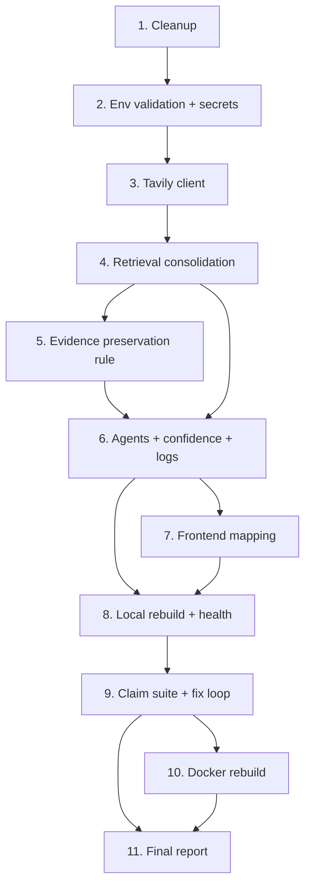

# Implementation Plan

## Overview

VeritasAI Reset, Rebuild, Fix & Validate. Local-development mode is primary; Docker is rebuilt and validated after local is green. Tasks are ordered so the system stays runnable throughout. Each task references the requirements and/or design properties it satisfies.

## Tasks

- [ ] 1. Phase 2 cleanup — stop project processes and Docker resources (scoped)
  - Stop project processes only: `pkill -f "uvicorn main:app"`, project `vite`/`npm run dev`, project python backend.
  - Bring down the project's compose stack: `docker compose down` from project root; remove only `veritas_*`/project-prefixed containers, networks, volumes, images.
  - Do NOT touch shared Ollama or unrelated containers; leave shared Ollama running.
  - Capture before/after `docker ps`, `ps`, and port checks (8000/5173/11434) into a cleanup report.
  - _Requirements: 2.1, 2.2, 2.3, 2.4, 2.5, 2.6_

- [x] 2. Phase 3 environment validation and corrections
- [x] 2.1 Validate and reconcile env files; produce corrections report
  - Inspect `backend/.env`, `backend/.env.example`, `.env.docker`, `frontend/react-app/.env` for duplicates/missing/invalid/conflicting values.
  - Produce the name-reconciliation table (`GOOGLE_API_KEY→GEMINI_API_KEY`, `JWT_SECRET→SECRET_KEY`, `NEO4J_USERNAME→NEO4J_USER`, `FRONTEND_URL→VITE_API_BASE_URL`, `BACKEND_URL→CORS_ORIGINS`).
  - Replace `SECRET_KEY` placeholder with a generated value for local validation; document it. Confirm `frontend/react-app/.env` → `VITE_API_BASE_URL=http://localhost:8000`.
  - Add `TAVILY_API_KEY` to `.env.example` (placeholder) and to `.env.docker`; ensure `.env.docker` has a working reasoning provider (valid Groq or real Gemini, not only `DISABLED`).
  - _Requirements: 3.1, 3.2, 3.3, 3.4, 3.5_
- [x] 2.2 Flag exposed secrets for rotation and ensure .env files are git-ignored
  - Confirm `.gitignore` ignores `backend/.env`, `.env.docker`, `frontend/react-app/.env`; keep only `*.example` tracked.
  - If any `.env` is tracked by git, untrack it (`git rm --cached`) without deleting the local file.
  - List every committed secret (by key name, not value) and recommend rotation in the report.
  - _Requirements: 3.6, 13.6 (security constraints)_

- [x] 3. Phase 4 — Tavily integration (primary provider)
- [x] 3.1 Add Tavily dependency and create the Tavily client module
  - Add pinned `tavily-python` to `backend/requirements.txt`.
  - Create `backend/rag/tavily_client.py` with `search_tavily(query, top_n=10, include_raw=True)` returning `(normalized_articles, meta)`.
  - Request `include_raw_content=True`, `search_depth="advanced"`; flow `raw_content → clean → chunk → rank`; cap `content`/`full_content` length and `top_n` to control tokens.
  - Normalize each result to the standard article shape with `evidence_source="tavily"` and `full_content` = cleaned raw content; `credibility_score` via `score_source(url)`.
  - Load `TAVILY_API_KEY`; expose `tavily_available`; log masked key presence at import. Degrade to `([], meta)` if key missing or request errors (never raise).
  - Emit logs: `TAVILY QUERY`, `TAVILY RESULTS COUNT`, `TAVILY SOURCES`, `TAVILY RESPONSE` (truncated).
  - _Requirements: 4.1, 4.2, 4.4, 4.5, 4.6_
  - _Properties: 2 (graceful degradation), 3 (normalization)_
- [x] 3.2 Write unit tests for the Tavily client
  - Test normalization shape and `credibility_score ∈ [0,1]`; test graceful degradation when key is unset (monkeypatched) — returns `([], meta)` and does not raise.
  - Assert the four log lines are emitted (caplog).
  - _Requirements: 4.4, 4.6_
  - _Properties: 2, 3_

- [x] 4. Phase 5 — Retrieval consolidation, Tavily-first chain
- [x] 4.1 Wire Tavily-first provider gather into retriever.py
  - Add `_gather_from_providers(query, top_n)` calling Tavily → SerpAPI → NewsAPI in order; concatenate with per-provider counts and logs; record attempt order in `meta`.
  - Update `retrieve_evidence` to use the gather function for every query variant, then merge → `_dedupe` → prefilter/rule filters → optional FAISS re-rank → top-k; include provider counts (`tavily/serpapi/newsapi`), `prefilter_stats`, `filter_stats`, `queries`, `retrieved_count`, `top_k` in `meta`.
  - Make the unified path run Tavily-first regardless of `VERITAS_USE_ADVANCED_RAG`; the flag now only gates the optional FAISS re-rank stage (documented).
  - Add a thin `retrieve_for_api(claim, ...)` wrapper (or expose `retrieve_evidence`) for `main.py`.
  - Keep `legacy/` fallback dataset (`_load_local_fallback`) as the final tier only.
  - _Requirements: 4.3, 4.7, 5.1, 5.3, 5.4_
  - _Properties: 1 (provider order), 2 (graceful degradation), 4 (dedup)_
- [x] 4.2 Retire retrieval.py and remove legacy imports from main.py
  - Remove the `from retrieval import (...)` block in `main.py`; replace the legacy fallback block inside `verify_claim` with a single call into `retriever.py` (`retrieve_for_api`/`retrieve_evidence`).
  - Delete `backend/retrieval.py` (the re-export shim). Update or remove any tests/modules importing `retrieval`/`legacy.retrieval`.
  - _Requirements: 5.3_
  - _Properties: 9 (single pipeline)_
- [x] 4.3 Add pipeline tracing logs and verify no path imports legacy retrieval
  - Add step-by-step trace logs (counts + samples) for: query generation → Tavily → SerpAPI → NewsAPI → merge/dedup → prefilter → rule filter → FAISS → top-k, including which stage dropped evidence and why.
  - Add a guard test asserting `main.py` no longer imports `retrieval`/`legacy.retrieval`.
  - _Requirements: 5.1, 5.2, 5.3_
  - _Properties: 9_

- [x] 4.4 MANDATORY CHECKPOINT — validate retrieval with "Is Islam older than Hinduism?"
  - Start the backend locally and POST the claim "Is Islam older than Hinduism?" to `/api/verify`.
  - Assert ALL of: Evidence Count > 0, Source Cards Present, Defender Output Present, Prosecutor Output Present, Judge Output Present.
  - Capture the trace logs (TAVILY/retrieval/agent) as checkpoint evidence.
  - STOP GATE: if any item fails, halt all further tasks and investigate retrieval (provider chain, prefilter drops, stance classifier) before proceeding. Do NOT touch Docker until this passes.
  - _Requirements: 4.7, 5.1, 5.5, 10.2, 12.1, 12.2_
  - _Properties: 1, 2, 4, 5, 10_

- [x] 5. Phase 5/6 — Evidence Preservation Rule (no agent starvation)
  - In `agents.py` `_filter_node`, enforce an explicit floor: when raw evidence exists, preserve ≥ 3 items (top-N by relevance/rag_score) for the agents unless retrieval returned fewer; log the relaxation.
  - Ensure Prosecutor and Defender both receive the same non-empty filtered list; log `DEFENDER INPUT`/`PROSECUTOR INPUT` with evidence counts and sample titles.
  - _Requirements: 4.7, 5.5, 6.4_
  - _Properties: 5 (evidence-to-agents)_

- [x] 6. Phase 6 — Agent audit, observability logs, and Judge wiring
- [x] 6.1 Add agent I/O logs and verify invocation/parsing
  - Add greppable logs: `DEFENDER INPUT`/`DEFENDER OUTPUT`, `PROSECUTOR INPUT`/`PROSECUTOR OUTPUT`, `JUDGE INPUT`/`JUDGE OUTPUT` (with verdict + confidence) in the agent modules/nodes.
  - Verify prompt construction and JSON parsing paths; ensure deterministic stance fallback triggers on empty/failed LLM output (already present) and is logged.
  - Confirm Judge always receives both prosecutor and defender result objects + evidence; log when either is empty.
  - _Requirements: 6.1, 6.2, 6.3, 6.5, 6.6_
  - _Properties: 6 (judge-input)_
- [x] 6.2 Make confidence evidence-based end to end
  - Route all non-override verdicts through `_normalize_confidence`; ensure deterministic-judge constants (41/44/62/63 magic) pass through normalization rather than leaking raw.
  - Clamp final confidence to integer `[0,100]`.
  - _Requirements: 6.5, 12.2_
  - _Properties: 7 (confidence-bounds), 8 (verdict-domain)_
- [x] 6.3 Write agent + confidence tests
  - With injected non-empty evidence, assert Prosecutor and Defender produce arguments and Judge returns a valid verdict + confidence.
  - Assert confidence varies with evidence (not constant) and stays within `[0,100]`; assert verdict ∈ allowed set.
  - _Requirements: 6.4, 6.5_
  - _Properties: 5, 6, 7, 8_

- [x] 7. Phase 7 — Frontend mapping fixes

- [x] 8.5 Judge logic hardening + recency awareness
  - Rule 1: never TRUE with `supporting_count == 0` (and symmetric FALSE guard); Rule 2/2b: strong-vs-strong or balanced even split → MISLEADING/UNVERIFIED unless one side overwhelmingly dominates; Rule 3: year/recency mismatch adds a time-period warning and reduces confidence (downgrades decisive verdicts when the gap is large); Rule 4: eliminate placeholder confidence 50.
  - Added `_extract_years`, `_compute_year_match` (exposes `year_match_score`), and `_harden_verdict` in `main.py`; wired into the verify flow after `_normalize_confidence`; `year_match_score`/`year_match` surfaced in `verdict_insights`.
  - Tests: `tests/test_judge_hardening.py` (9 cases) all pass; relevance tests updated to patch Tavily.
  - _Requirements: 6.5, 12.2, 12.3_
  - _Properties: 7 (confidence-bounds), 8 (verdict-domain)_

- [ ] 8. Phase 9/10 — Local rebuild, start, and health checks
- [ ] 8.1 Install dependencies and verify imports
  - Install backend `requirements.txt` (incl. `tavily-python`) into the working Python environment; resolve any version conflicts and document them.
  - Install frontend deps (`npm install --legacy-peer-deps`).
  - Verify backend imports succeed (no `ModuleNotFoundError`) and `agents`, `main`, `rag.retriever`, `rag.tavily_client` import cleanly.
  - _Requirements: 9.2, 9.3, 9.4_
- [ ] 8.2 Start services and run health checks
  - Start backend (`uvicorn main:app --port 8000`) and frontend (`npm run dev`); start Ollama only if used.
  - Verify `/api/health`; verify frontend reachable on :5173; verify Tavily reachable (key loaded + one successful sample query); verify Ollama/Neo4j only if enabled.
  - _Requirements: 10.1, 10.2, 10.3, 10.4_

- [ ] 9. Phase 11/12 — Automated claim suite and quality fix loop
- [ ] 9.1 Build/extend the 8-claim validation runner
  - Add a runner (extend `backend/test_claims.py` or new script) that POSTs all 8 claims to `/api/verify` and records, per claim: retrieved sources, evidence count, supporting/contradicting counts, prosecutor output, defender output, judge output, verdict, confidence.
  - Compare against expected verdicts (FALSE, FALSE, FALSE, TRUE, TRUE, TRUE, evidence-based, FALSE) and emit a pass/mismatch table plus retrieval/agent/evidence metrics.
  - _Requirements: 11.1, 11.2, 11.3, 11.4_
  - _Properties: 8, 10_
- [ ] 9.2 Run the suite and fix quality issues until green
  - Run the runner; for any `UNVERIFIED`/`INSUFFICIENT_DATA`/no-evidence/no-prosecutor result, investigate the trace logs and fix root cause (retrieval, filtering floor, stance partition, confidence).
  - Re-run until: evidence cards appear, Prosecutor works, Defender works, Judge works, confidence is meaningful, sources appear — for all claims with genuine evidence; Claim 7 yields a coherent evidence-based result rather than an empty/error.
  - _Requirements: 12.1, 12.2, 12.3, 12.4_
  - _Properties: 5, 6, 7, 8, 10_

- [ ] 10. Phase 9 (Docker) — Docker rebuild and validation after local is green
  - With `.env.docker` corrected (Tavily key + working reasoning provider), rebuild images/containers/networks: `docker compose build --no-cache && docker compose up -d`.
  - Validate compose health for ollama/backend/frontend; hit backend `/api/health` (host :8001) and frontend (:5174); run a smoke claim.
  - Do NOT modify unrelated containers or shared Ollama.
  - _Requirements: 9.1, 10.1, 10.2, 10.3_

- [ ] 11. Phase 13 — Final report
  - Compile: root causes found, files modified (with diffs), Docker changes, backend changes, frontend changes, environment changes, evidence-retrieval fixes, agent fixes, commands used, and validation results (per-claim table + retrieval/agent/evidence metrics).
  - State final run mode and how to start the system; include the Docker rebuild outcome and the secret-rotation recommendations (by key name).
  - _Requirements: 13.1, 13.2, 13.3_

## Task Dependency Graph



```json
{
  "waves": [
    { "wave": 1, "tasks": ["1"] },
    { "wave": 2, "tasks": ["2"] },
    { "wave": 3, "tasks": ["3"] },
    { "wave": 4, "tasks": ["4"] },
    { "wave": 5, "tasks": ["5"] },
    { "wave": 6, "tasks": ["6"] },
    { "wave": 7, "tasks": ["7"] },
    { "wave": 8, "tasks": ["8"] },
    { "wave": 9, "tasks": ["9"] },
    { "wave": 10, "tasks": ["10", "11"] }
  ]
}
```

## Notes

- Local-first: Tasks 1–9 fully validate the system in local mode before any Docker work (Task 10).
- **Mandatory checkpoint (Task 4.4)**: after Retrieval Consolidation, the "Is Islam older than Hinduism?" claim must pass all five checks (evidence count > 0, source cards, defender, prosecutor, judge). If it fails, all further tasks stop until retrieval is fixed. No Docker delete/rebuild until local validation passes.
- Safety: cleanup (Task 1) and Docker rebuild (Task 10) are scoped to project resources only; shared Ollama and unrelated containers are never modified.
- Secrets: the committed API keys are flagged for rotation in Task 2.2 and reported by key name only (never echoed).
- Each task is verified before moving on (imports succeed, lint/build pass, health checks green); the claim suite in Task 9 is the primary correctness gate.
- Property references map to the design's Correctness Properties; the claim runner and unit tests provide the evidence they hold.
