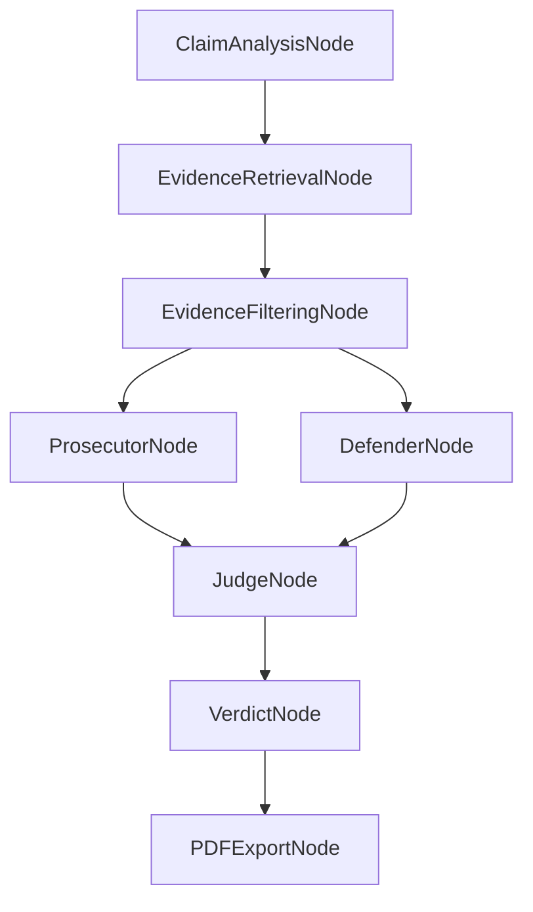

# PROJECT_RUNTIME_CONTEXT

This document preserves the current working state of the VeritasAI project. It provides a detailed breakdown of the architecture, endpoints, configurations, agents, and dependencies to assist future AI agents, developers, and deployment orchestration (e.g., Docker Compose).

---

## 1. PROJECT OVERVIEW

**VeritasAI** is an explainable fact-checking platform that analyzes misinformation through multi-agent debate and evidence-based reasoning. Rather than a black-box model output, it utilizes a sophisticated Retrieval-Augmented Generation (RAG) pipeline combined with competing LLM agents to provide a structured, transparent verdict.

- **Frontend**: React 19 + Vite + Tailwind CSS. Provides real-time pipeline visualization, result dashboards, evidence cards, voice input/output, and historical tracking.
- **Backend**: FastAPI (Python 3.10+). Handles REST APIs, authentication, SQLite/Neo4j database interactions, and PDF generation.
- **Orchestration (LangGraph)**: Directs a sequence of analytical nodes: Claim Analysis → Evidence Retrieval → Filtering → Parallel Agent Reasoning (Prosecutor & Defender) → Judge Synthesis → Verdict Generation.
- **RAG Workflow**: Integrates Google Search (SerpAPI), NewsAPI, and DuckDuckGo. Fetched pages are scraped, cleaned, chunked, and embedded (Sentence-Transformers). Results are ranked using a hybrid keyword/semantic strategy and indexed locally in FAISS.
- **Adversarial Debate**: 
  - **Prosecutor**: Attempts to debunk the claim.
  - **Defender**: Attempts to support the claim.
  - **Judge**: Weighs arguments, assigns a confidence score, and derives a final verdict (`TRUE`, `FALSE`, `MISLEADING`, `UNVERIFIED`, `INSUFFICIENT_DATA`).
- **LLM Fallback Chain**: Designed to use Google Gemini for primary heavy-lifting/reasoning and gracefully fall back to local Ollama (`mistral`/`llama3.2:1b`) for fast local analysis or offline recovery.
- **Neo4j / Graph**: Optional graph persistence for relation mapping across evidence sources and claims.

---

## 2. COMPLETE DIRECTORY STRUCTURE

```text
fake-news-ai/
├── README.md
├── PROJECT_SETUP_GUIDE.md
├── PROJECT_RUNTIME_CONTEXT.md         # This file
├── .env.example
├── .github/
│   └── workflows/
│       └── secret-scan.yml            # CI/CD secret scanning
├── backend/
│   ├── main.py                        # FastAPI application & API router
│   ├── agents.py                      # LangGraph definition & state orchestration
│   ├── state.py                       # LangGraph VerificationState definition
│   ├── llm_client.py                  # Primary/Fallback LLM routing (Gemini/Ollama)
│   ├── rag_core.py                    # RAG hybrid scoring logic
│   ├── retrieval.py                   # Multi-API aggregator (SerpAPI, NewsAPI)
│   ├── filters.py                     # Quality filters for sources
│   ├── credibility.py                 # Domain reputation scoring
│   ├── database.py                    # SQLAlchemy models & SQLite config
│   ├── auth.py                        # JWT/bcrypt authentication logic
│   ├── pdf_export.py                  # ReportLab PDF generation
│   ├── graph.py                       # Neo4j integration
│   ├── validate_api_keys.py           # API Key testing utility
│   ├── requirements.txt               # Backend Python dependencies
│   ├── agents/
│   │   ├── claim_analyzer.py          # Claim decomposition & entity extraction
│   │   ├── prosecutor.py              # Prosecutor agent node
│   │   ├── defender.py                # Defender agent node
│   │   ├── judge.py                   # Judge agent node
│   │   └── source_tracker.py          # Evidence citation attribution
│   ├── rag/
│   │   ├── retriever.py               # Core search, BS4 scraping, FAISS indexing
│   │   ├── embeddings.py              # SentenceTransformer wrappers
│   │   ├── faiss_store.py             # Vector store operations
│   │   ├── knowledge_base.py          # Indexing utils
│   │   └── realtime_fetcher.py        # Web content fetcher
│   ├── services/
│   │   ├── cache_service.py           # Semantic cache implementation
│   │   ├── credibility_service.py     # Aggregated credibility calculation
│   │   ├── evidence_classifier.py     # Supports/Contradicts categorizer
│   │   ├── metrics_service.py         # App analytics
│   │   ├── ranking_service.py         # Custom ranking logic
│   ├── tests/                         # Pytest test suite
│   └── data/
│       └── news_articles.json         # Offline fallback dataset
└── frontend/
    └── react-app/
        ├── package.json
        ├── vite.config.js
        ├── index.html
        └── src/
            ├── main.jsx               # React entry point
            ├── App.jsx                # Router & Theme
            ├── App.css                # Global styling
            ├── hooks/
            │   └── useVoice.js        # Speech-to-text / Text-to-speech
            ├── services/
            │   └── api.js             # Axios client endpoints
            ├── lib/
            │   └── utils.ts           # Helper functions
            ├── pages/
            │   ├── Home.jsx           # Main verification workspace
            │   ├── History.jsx        # Historical claims dashboard
            │   ├── Stats.jsx          # Analytics
            │   ├── Login.jsx          # Auth UI
            │   ├── Register.jsx       # Auth UI
            │   └── Profile.jsx        # User settings
            └── components/
                ├── AgentCard.jsx      # UI for Prosecutor/Defender
                ├── EvidenceCard.jsx   # UI for retrieved articles
                ├── ConfidenceGauge.jsx# Circular confidence meter
                ├── VerdictBadge.jsx   # Colored verdict indicator
                ├── PipelineProgress.jsx# Real-time state visualization
                ├── SkeletonCard.jsx   # Loading state
                └── MetricsPanel.jsx   # Dashboard metrics
```

---

## 3. CURRENT RUNNING STACK

### Frontend
- **Framework**: React 19.2.4
- **Build Tool**: Vite 8.0.1
- **Port**: 5173
- **State Management**: React Hooks (`useState`, `useEffect`, `useCallback`)
- **UI Libraries**: Tailwind CSS (via tailwind-merge), Lucide React (Icons)
- **Animation Libraries**: Framer Motion 12.38.0
- **Charts**: Chart.js 4.5.1
- **HTTP Client**: Axios 1.13.6

### Backend
- **Framework**: FastAPI 0.111.0
- **Server**: Uvicorn 0.29.0
- **Port**: 8000
- **Orchestration**: LangGraph 0.2.66, LangChain Core compat.
- **Databases**: SQLite (persistent, `veritas.db`), Neo4j (graph, optional)
- **Vector DB / Search**: FAISS 1.8.0 (CPU), Sentence-Transformers 2.7.0
- **PDF Generation**: ReportLab 4.5.0
- **Concurrency**: Asyncio natively, thread pools for blocking CPU tasks (FAISS, ReportLab).

### LLM
- **Primary Reasoning (Judge/Agents)**: Google Gemini (`gemini-2.5-flash`)
- **Local Fallback Reasoning**: Ollama (`mistral:latest`)
- **Analysis / Planning**: Ollama (`llama3.2:1b`)
- **Embeddings**: Sentence-Transformers (local execution)

---

## 4. COMPLETE API ENDPOINTS

| Route | Method | Purpose | Request Body | Response Structure | Called Services |
|---|---|---|---|---|---|
| `/api/verify` | POST | Full verification pipeline | `{"claim": "string"}` | `{"success": true, "verdict": "TRUE", "evidence": [...], "stages": {...}}` | `run_claim_graph`, `retrieve_evidence` |
| `/api/verify/batch` | POST | Verify up to 5 claims concurrently | `{"claims": ["str1", "str2"]}` | `{"results": [...], "count": 2}` | `_verify_single_claim` (threaded) |
| `/api/verify/quick` | POST | Quick wrapper for verification | `{"claim": "string"}` | Same as `/api/verify` | `verify_claim` |
| `/api/claims/history` | GET | Retrieve user/guest history | `limit=5` (Query) | `{"claims": [...], "is_authenticated": true/false}` | `db.query(ClaimHistory)` |
| `/api/claims/history/{id}` | GET | Get detailed snapshot | - | JSON of original verify payload | `db.query(ClaimHistory)` |
| `/api/export/pdf/{id}` | GET/HEAD | Download PDF report | - | File Blob (application/pdf) | `generate_verdict_pdf` |
| `/api/claims/history/{id}/export` | GET/HEAD | Download PDF report alias | - | File Blob (application/pdf) | `generate_verdict_pdf` |
| `/api/stats` | GET | System/User analytics | - | `{"total_claims": X, "avg_confidence": Y}` | `db.query(ClaimHistory)` |
| `/api/trending` | GET | Top trending verified claims | - | `[{"claim_text": "...", "count": X}]` | SQL GroupBy |
| `/api/health` | GET | Check LLM/API status | - | `{"status": "ok", "services": {...}}` | `test_all_connections` |
| `/api/sources` | GET | List available sources | - | `[]` | - |
| `/api/share/{id}` | GET | Fetch public shared verdict | - | JSON verify payload | `get_claim_by_short_id` |
| `/api/auth/check-username` | GET | Check username availability | `username=str` | `{"exists": bool}` | `db.query(User)` |
| `/api/auth/check-email` | GET | Check email availability | `email=str` | `{"exists": bool}` | `db.query(User)` |
| `/api/auth/register` | POST | Register user | `{"username": "...", "email": "...", "password": "..."}` | `{"access_token": "...", "user": {...}}` | `get_password_hash` |
| `/api/auth/login` | POST | Login user | `{"username": "...", "password": "..."}` | `{"access_token": "...", "user": {...}}` | `verify_password`, `create_access_token` |
| `/api/auth/me` | GET | Get logged-in user | - | `{"id": X, "username": "...", "email": "..."}` | `get_current_user` |

---

## 5. LANGGRAPH FLOW

LangGraph orchestrates the multi-agent execution logically and deterministically.

### State Schema (`VerificationState`)
Tracks variables across graph execution: `claim`, `analysis`, `evidence`, `prosecutor`, `defender`, `judge`, `verdict`, `confidence`, `reasoning_points`, `disagreement_score`, `completed_stages`, `errors`.

### Node Execution Flow


### Characteristics
- **Parallel Execution**: `ProsecutorNode` and `DefenderNode` execute concurrently.
- **Blocking Services**: `EvidenceRetrievalNode` handles synchronous HTTP requests and FAISS operations.
- **Fallback Flow**: If LangGraph fails to load (due to older LangChain versions), a sequential fallback function `_run_sequential` automatically takes over to ensure API uptime.
- **Error Handling**: Exceptions inside nodes are caught, appended to `state["errors"]`, and `stage_failed` is logged. Execution can continue gracefully if partial evidence exists.

---

## 6. LLM CONFIGURATION

LLM routing is centralized in `backend/llm_client.py`.

### Environment Variables & Models
- `GEMINI_API_KEY`: Primary reasoning API key.
- `GEMINI_MODEL`: `gemini-2.5-flash`
- `OLLAMA_BASE_URL`: `http://localhost:11434`
- `OLLAMA_ANALYZER_MODEL`: `llama3.2:1b` (Used for fast intent/entity extraction)
- `OLLAMA_MODEL`: `mistral:latest` (Used for reasoning fallback)

### Behavior
- `call_ollama()`: Interacts locally via REST (`POST /api/generate`). Token limits around `400`. Temperature `0.2`. Context window `2048`.
- `call_gemini()`: Interacts via `google-generativeai` SDK. Token limits up to `700`. Temperature `0.2 - 0.3`.
- `call_reasoning()`: Attempts Gemini first. If failure or timeout occurs after 30 seconds, fails over automatically to Ollama.
- `extract_json()`: Safely strips markdown/thinking tags (`<think>`) from LLM responses to parse raw JSON.

---

## 7. AGENT SYSTEM

### 1. Claim Analyzer (`agents/claim_analyzer.py` / `rag/retriever.py`)
- **Purpose**: Analyzes the claim, extracts entities, and categorizes intent.
- **Input**: Raw claim string.
- **Output**: JSON containing `entities`, `intent`, `keywords`, `domain`, `should_proceed`.
- **Reasoning**: Uses Ollama to understand if the input is gibberish, subjective opinion, or factual. Generates optimized search keywords.

### 2. Prosecutor (`agents/prosecutor.py`)
- **Purpose**: Acts adversarially against the claim.
- **Input**: Claim + retrieved evidence list.
- **Output**: Counter-arguments, contradicting points, and a `prosecution_strength` (`strong`, `moderate`, `weak`, `none`).
- **Prompt Logic**: "You are an adversarial prosecutor. Find weaknesses in the claim."

### 3. Defender (`agents/defender.py`)
- **Purpose**: Acts favorably towards the claim.
- **Input**: Claim + retrieved evidence list.
- **Output**: Supporting arguments, verified points, and a `defense_strength` (`strong`, `moderate`, `weak`, `none`).
- **Prompt Logic**: "You are a defense attorney. Find strengths in the claim."

### 4. Judge (`agents/judge.py`)
- **Purpose**: Synthesizes the debate into a final verdict.
- **Input**: Prosecutor args, Defender args, Evidence list.
- **Output**: `verdict` (TRUE/FALSE/MISLEADING/UNVERIFIED), `confidence` (0-100), `reasoning`.
- **Reasoning**: Weighs evidence credibility and argument strength. Penalizes hallucination. If evidence is lacking, outputs `INSUFFICIENT_DATA`.

---

## 8. RAG PIPELINE

Located predominantly in `backend/rag/retriever.py`.

### Retrieval Flow
1. **Query Expansion**: Adds misinfo-specific triggers (e.g., "5g", "covid") into the search query if detected.
2. **Aggregated Search**: Hits SerpAPI and NewsAPI concurrently. Uses retry backoff mechanics.
3. **Content Extraction**: Downloads URLs via `requests`. Parses via `BeautifulSoup`. Strips nav, footers, ads (`NAV_GARBAGE_PATTERNS`). Fallbacks to regex parsing.
4. **Chunking**: Text split into ~120-word chunks.
5. **Prefiltering**: Discards outdated articles (age > 120 days) or low credibility un-trusted sources.
6. **Embedding & Similarity**: Uses `Sentence-Transformers` to generate embeddings for the claim and content chunks.
7. **FAISS Indexing**: Indexes chunks in memory, runs Cosine Similarity search.
8. **Hybrid Scoring**: Combines Embedding Similarity (weight: 0.6) and BM25/Keyword Overlap (weight: 0.4).
9. **Final Ranking**: Top 5-10 sources passed to agents.

---

## 9. FRONTEND FLOW

### Home Page (`Home.jsx`)
- **Input**: User types or speaks (Voice Recognition) a claim.
- **State**: Maintains `claim`, `result`, `loading`, `pipelineMessage`.
- **API Call**: Triggers `verifyClaim(claim)`. Backend headers return processing times.
- **Cache**: Uses `localStorage` (`veritas-results-cache`) to instantly display historical runs before background refresh.
- **Render Pipeline**: `PipelineProgress.jsx` reflects backend LangGraph stages dynamically.
- **Verdict View**: `VerdictBadge`, `ConfidenceGauge` rendered via Chart.js and Framer Motion.
- **Agent Rendering**: `AgentCard` maps out Prosecutor and Defender arguments side-by-side.
- **Export**: "Download PDF" button interacts with the backend PDF endpoint.
- **Voice Output**: Speech synthesis reads out the final verdict text.

---

## 10. CURRENT PORTS AND SERVICES

| Service | Port | How Started | Notes |
|---|---|---|---|
| **Frontend (Vite)** | `5173` | `npm run dev` | Binds to 0.0.0.0. React UI. |
| **Backend (Uvicorn)**| `8000` | `uvicorn main:app` | FastAPI core endpoints. |
| **Ollama** | `11434`| `ollama serve` | Local LLM inference server. |
| **Neo4j** (Optional)| `7687` | Docker / Native | Graph DB. Connected via Bolt. |

---

## 11. CURRENT STARTUP COMMANDS

**Backend:**
```bash
cd backend
source venv/bin/activate
pip install -r requirements.txt
python3 -m uvicorn main:app --host 0.0.0.0 --port 8000 --reload
```

**Frontend:**
```bash
cd frontend/react-app
npm install --legacy-peer-deps
npm run dev -- --host 0.0.0.0 --port 5173
```

**Ollama:**
```bash
ollama serve
```

---

## 12. ENVIRONMENT VARIABLES

**Backend (`backend/.env`)**
```env
SECRET_KEY=***
CORS_ORIGINS=http://localhost:5173,http://127.0.0.1:5173
DATABASE_URL=sqlite:///./veritas.db

NEWSAPI_KEY=***
SERPAPI_KEY=***

GEMINI_API_KEY=***
GEMINI_MODEL=gemini-2.5-flash

OLLAMA_BASE_URL=http://localhost:11434
OLLAMA_ANALYZER_MODEL=llama3.2:1b
OLLAMA_MODEL=mistral:latest

VERITAS_DISABLE_OLLAMA=0
VERITAS_USE_ADVANCED_RAG=1
RAG_MAX_AGE_DAYS=120
RAG_API_CACHE_TTL_SECONDS=900

NEO4J_URI=bolt://localhost:7687
NEO4J_USER=neo4j
NEO4J_PASSWORD=***
```

**Frontend (`frontend/react-app/.env`)**
```env
VITE_API_BASE_URL=http://localhost:8000
```

---

## 13. DEPENDENCIES

**Backend (Python)**
- `fastapi==0.111.0`, `uvicorn==0.29.0`
- `sqlalchemy==2.0.30`
- `langgraph==0.2.66`, `langchain-core`
- `faiss-cpu==1.8.0`, `sentence-transformers==2.7.0`, `numpy`
- `requests`, `beautifulsoup4`
- `reportlab==4.5.0`
- `python-jose`, `passlib`, `bcrypt`
- `neo4j`

**Frontend (Node.js)**
- `react@19.2.4`, `react-dom@19.2.4`
- `vite@8.0.1`
- `react-router-dom@7.13.1`
- `axios@1.13.6`
- `framer-motion@12.38.0`
- `chart.js@4.5.1`, `react-chartjs-2`
- `lucide-react`
- `tailwindcss`, `tailwind-merge`

---

## 14. DATABASES / STORAGE

- **SQLite (`veritas.db`)**: Local relational database. Houses `users`, `claim_history`, and `claim_cache` tables. Used for JWT auth and historical verification viewing.
- **Neo4j**: Optional local Graph database tracking relations between claims, sources, and reputation markers. Managed through `backend/graph.py`.
- **FAISS Index**: In-memory ephemeral vector store active only during the context phase of RAG retrieval.
- **Frontend Cache**: Browser `localStorage` holds the `veritas-results-cache` payload to display old verifications instantaneously before backend refreshes.
- **PDF Storage**: Ephemeral byte streams dynamically generated by ReportLab upon `/api/export/pdf` request. Not saved to disk.

---

## 15. CURRENT KNOWN ISSUES & TECH DEBT

- **LangGraph Compatibility Hack**: `backend/agents.py` currently injects missing `langchain` root attributes (`debug`, `verbose`, `llm_cache`) due to mismatched LangChain core dependencies in some environments.
- **Web Scraping Rate Limits**: Relying on BS4 extraction means some sources (e.g., Reuters, NYT) will actively block or rate limit requests returning 403s. A regex fallback exists but misses deeper content.
- **Ollama Cold Starts**: The first `/api/verify` request directed to Ollama might timeout if models (`llama3.2:1b`, `mistral`) are not resident in VRAM/RAM.
- **Cache Divergence**: Frontend and backend caching may sometimes be out of sync for a few seconds. The UI mitigates this by saying "Refreshing with latest evidence...".
- **Legacy API Dependencies**: Mentions of `deepseek` and `groq` exist inside API structures but logic explicitly favors Gemini and Ollama.

---

## 16. DOCKERIZATION READINESS

- **Backend**: Docker-ready. A standard `python:3.10-slim` image installing `requirements.txt` will suffice. `veritas.db` requires a persistent Docker Volume mount. Port `8000` must be exposed.
- **Frontend**: Docker-ready via multi-stage build (`node:18` build → `nginx:alpine` serve). API URL must be injected via build arguments or runtime template replacement.
- **Ollama**: Requires a separate container running `ollama/ollama`.
  - **Networking Concern**: The backend currently targets `http://localhost:11434`. Inside Docker, this must become `http://ollama:11434` or `host.docker.internal`.
  - **GPU Acceleration**: A deployment requiring Ollama with CUDA acceleration requires the `--gpus all` flag in Compose.
- **Neo4j**: Ready for a standard `neo4j:latest` image mapped to port 7687.
- **Compose Readiness**: The environment is highly modular. Only environment variables (`OLLAMA_BASE_URL`, `CORS_ORIGINS`, `DATABASE_URL`) need redirection.

---

## 17. CURRENT WORKING STATUS

- **Highly Stable**: React UI, FastAPI integration, RAG web retrieval (SerpAPI/NewsAPI), SQLite caching, Auth, PDF export.
- **Functional but Environment Dependent**: LangGraph orchestration relies on precise Python package versions. Local Ollama execution relies on hardware performance.
- **Partially Working**: BeautifulSoup website scraping heavily depends on anti-bot protection of target sites.
- **Future Improvements**: Transition from raw SQLite to PostgreSQL for scale. Enhance BS4 with a headless browser (Playwright) for better extraction. Add WebSocket streaming for partial LangGraph stage completion.

---

## 18. FINAL DEPLOYMENT CHECKLIST

For future Docker Compose deployment, ensure the following are implemented:

- [ ] **Backend Dockerfile**: `COPY requirements.txt`, `pip install`, `CMD ["uvicorn", "main:app", "--host", "0.0.0.0"]`.
- [ ] **Frontend Dockerfile**: Multi-stage build (Vite build → Nginx).
- [ ] **Docker Compose Config**: Define services for `backend`, `frontend`, and `ollama`.
- [ ] **Networking**: Update `.env` variables to reference Docker service names (`OLLAMA_BASE_URL=http://ollama:11434`).
- [ ] **CORS Adjustment**: Ensure backend `CORS_ORIGINS` includes the Nginx hostname/port.
- [ ] **Volumes**: Map `./veritas.db` to a named volume. Map `ollama` model cache to a volume to avoid re-pulling models.
- [ ] **Ollama Init Script**: Create a startup hook to run `ollama pull llama3.2:1b` and `ollama pull mistral:latest` automatically if not present.
- [ ] **Health Checks**: Add `healthcheck` to Compose targeting `/api/health`.