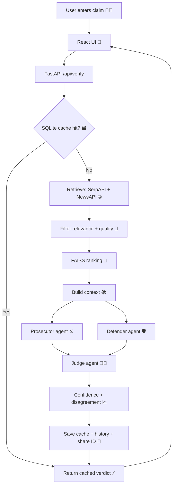
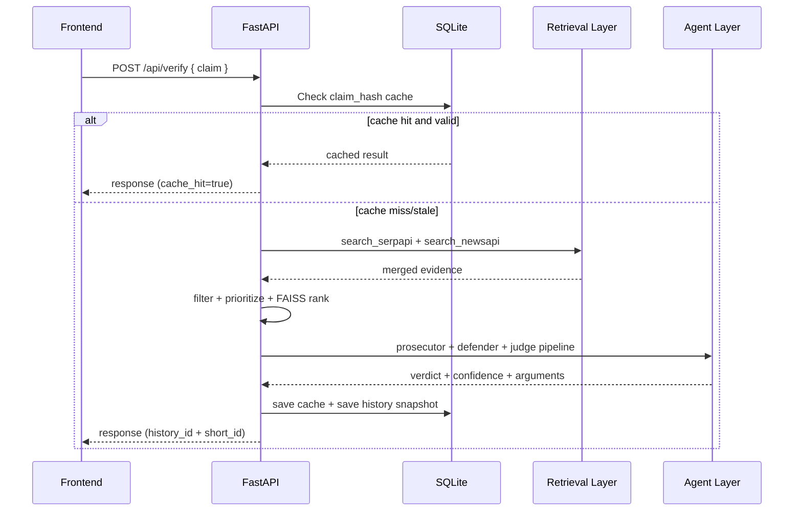
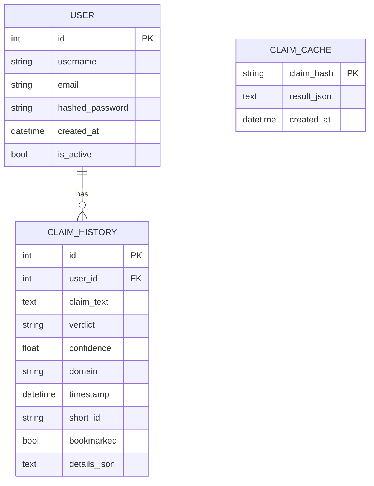

<div align="center">

# VeritasAI 🔎🧠⚖️

### Fake News ❌ -> Facts ✅

<p>
  
</p>

<p>
  
  
  
  
  
  
</p>

<p>
  
  
  
  
  
  
</p>

</div>

---

## What Is VeritasAI? 📰➡️📊

VeritasAI is a full-stack misinformation verification platform that analyzes a claim using:

- Hybrid retrieval (SerpAPI + NewsAPI)
- Relevance filtering + domain quality filtering
- FAISS ranking for evidence prioritization
- Multi-agent argument generation (Prosecutor ⚔️ / Defender 🛡️ / Judge 👩‍⚖️)
- Confidence + disagreement scoring
- History persistence, shareable results, and PDF export

It is designed to be explainable, not just predictive.

---

## Current Highlights (April 2026) ✨

- ✅ End-to-end claim verification API with resilient fallback behavior
- ✅ Batch verification endpoint (`/api/verify/batch`)
- ✅ Source-backed reasoning with per-side evidence cards
- ✅ Disagreement score (`0.0` to `1.0`) included in verify response
- ✅ JWT auth flows (register/login/me)
- ✅ History snapshots + share links via `short_id`
- ✅ PDF export endpoint supports both `GET` and `HEAD`
- ✅ Frontend includes replay, confidence gauge, reasoning, and evidence visualization

---

## Architecture Overview 🏗️



---

## Runtime Sequence (How a Verify Request Works) 🧭



---

## Tech Stack Map 🧰

| Technology | Where | Why |
|---|---|---|
| FastAPI | `backend/main.py` | REST API, orchestration, middleware, startup/shutdown hooks |
| SQLAlchemy + SQLite | `backend/database.py` | Users, history, cache persistence |
| JWT + bcrypt | `backend/auth.py` | Secure auth and password hashing |
| SerpAPI + NewsAPI | `backend/retrieval.py` | Multi-source web/news evidence retrieval |
| FAISS | `backend/rag_core.py` | Semantic ranking of candidate evidence |
| Gemini/Grok/Ollama fallback chain | `backend/llm_client.py`, `backend/gemini_client.py` | Robust LLM reasoning fallback strategy |
| Multi-agent orchestration | `backend/agents.py` | Prosecutor/Defender/Judge debate pipeline |
| ReportLab | `backend/pdf_export.py` | Export claim verdict reports as PDF |
| React + Vite | `frontend/react-app/src` | Interactive verification UI |
| Axios | `frontend/react-app/src/services/api.js` | API client integration |
| Framer Motion + AOS + Chart.js | frontend pages/components | UX animation + analytics visuals |

---

## Folder Walkthrough 🗂️

```text
fake-news-ai/
  backend/
    main.py                  # Core API routes and verification orchestration
    agents.py                # Debate helpers + disagreement scoring
    rag_core.py              # FAISS ranking + context builder
    retrieval.py             # SerpAPI/NewsAPI query + relevance logic
    filters.py               # Source quality and self-source filtering
    database.py              # ORM models + migrations + cache IO
    auth.py                  # JWT auth and user verification
    llm_client.py            # LLM fallback chain (Gemini -> Grok -> Ollama)
    pdf_export.py            # PDF generation
    rag/                     # Extra RAG modules and utilities
    graph/                   # Neo4j client

  frontend/react-app/
    src/pages/Home.jsx       # Main verification workflow UI
    src/pages/History.jsx    # History list/detail replay
    src/pages/Stats.jsx      # Analytics dashboard
    src/pages/Login.jsx      # Login screen
    src/pages/Register.jsx   # Register screen
    src/pages/Profile.jsx    # Profile screen
    src/components/          # UI building blocks (gauge, cards, badges)
    src/services/api.js      # Backend API bindings
```

---

## Setup & Run 🚀

### Prerequisites

- Python 3.10+
- Node.js 18+
- npm 9+
- Optional: Ollama runtime (`ollama serve`) for local LLM fallback
- Optional: Neo4j server for graph persistence

### 1) Backend

```bash
cd fake-news-ai/backend
python3 -m venv .venv
source .venv/bin/activate
pip install -r requirements.txt
uvicorn main:app --host 0.0.0.0 --port 8000 --reload
```

Health check:

```bash
curl -s http://localhost:8000/api/health
```

### 2) Frontend

```bash
cd fake-news-ai/frontend/react-app
npm install --legacy-peer-deps
npm run dev -- --host 0.0.0.0 --port 5173
```

Open:

- Frontend: http://localhost:5173
- Backend: http://localhost:8000

---

## Environment Variables 🔐

Create `backend/.env`:

```env
# Security
SECRET_KEY=change_this_for_production

# LLMs
GEMINI_API_KEY=
GEMINI_MODEL=gemini-1.5-flash
GROK_API_KEY=
GROK_MODEL=grok-beta
OLLAMA_URL=http://localhost:11434
OLLAMA_MODEL=llama3.2:3b

# Search APIs
SERPAPI_KEY=
NEWSAPI_KEY=

# Storage
DATABASE_URL=sqlite:///./veritas.db

# Optional graph
NEO4J_URI=bolt://localhost:7687
NEO4J_USER=neo4j
NEO4J_PASSWORD=password
```

---

## API Documentation 📡

### Verification Endpoints

| Method | Endpoint | Purpose |
|---|---|---|
| POST | `/api/verify` | Verify one claim with full pipeline |
| POST | `/api/verify/batch` | Verify up to 5 claims concurrently |
| POST | `/api/verify/quick` | Shortcut wrapper around verify |

### History, Share, Export

| Method | Endpoint | Purpose |
|---|---|---|
| GET | `/api/claims/history` | Return claims list (`claims`, `is_authenticated`, `total`) |
| GET | `/api/claims/history/{history_id}` | Detailed history snapshot |
| GET | `/api/claims/history/{history_id}/export` | Download PDF report |
| HEAD | `/api/claims/history/{history_id}/export` | Metadata/content-type check for PDF |
| GET | `/api/share/{short_id}` | Public/shared view by short id |

### Auth and Utility

| Method | Endpoint | Purpose |
|---|---|---|
| GET | `/api/auth/check-username` | Username availability check |
| GET | `/api/auth/check-email` | Email availability check |
| POST | `/api/auth/register` and `/api/auth/register/` | Register user |
| POST | `/api/auth/login` and `/api/auth/login/` | Login by username/email |
| GET | `/api/auth/me` and `/api/auth/me/` | Current authenticated user |
| GET | `/api/stats` | Aggregate verification stats |
| GET | `/api/trending` | Trending claims |
| GET | `/api/health` | Service + LLM connection status |
| GET | `/api/sources` | Placeholder endpoint |

---

## Verify Response Shape (Important) 📦

Typical `/api/verify` response includes:

- `verdict`: `TRUE | FALSE | MISLEADING | UNVERIFIED`
- `confidence`: normalized integer score
- `disagreement_score`: float in range `0.0..1.0`
- `reasoning`, `reasoning_points`
- `prosecutor` and `defender` arguments/strength
- `prosecutor_evidence`, `defender_evidence`, `evidence`, `sources`
- `history_id`, `short_id`, `processing_time_seconds`, `cache_hit`

---

## Frontend Experience Map 🎛️

- Home page:
  - Submit claim
  - Pipeline progress states and animated execution stages
  - Verdict badge + confidence gauge + contentiousness label
  - Prosecutor/Defender cards + evidence cards
  - Copy share link button using `short_id`
- History page:
  - Fetch prior claims
  - Drill into detailed snapshots
  - Replay claim analysis
- Stats page:
  - Dashboard metrics and chart visualizations

---

## Data Model Snapshot 🗃️



Note: A compatibility `claims` table shape is also maintained in migrations for older checks.

---

## Reliability & Fallback Strategy 🛟

LLM fallback chain:

1. Gemini
2. Grok
3. Ollama
4. Emergency deterministic fallback object

This keeps the API resilient even when cloud quota/network issues occur.

---

## Known Limitations ⚠️

- LLM quality and external source quality still dominate final verdict quality.
- News freshness can lag for breaking events.
- Heuristic stance partitioning can occasionally misclassify nuanced evidence.
- Frontend local cache and backend cache are separate layers and can diverge temporarily.
- CORS is currently permissive (`*`) and should be restricted in production.

---

## Troubleshooting 🧯

### 1) npm install fails due to peer dependency resolution

```bash
npm install --legacy-peer-deps
```

### 2) Import conflict around `rag`

Project now uses `backend/rag_core.py` (not `backend/rag.py`) to avoid package-shadow conflict with `backend/rag/`.

### 3) Health status is degraded

`/api/health` may show degraded when LLM providers are unreachable or quota-limited. API still serves requests via fallback logic.

### 4) Quick syntax validation

```bash
cd fake-news-ai
python3 -c "import ast, sys
files = [
  'backend/main.py', 'backend/agents.py', 'backend/database.py',
  'backend/credibility.py', 'backend/pdf_export.py'
]
ok = True
for f in files:
    try:
        with open(f) as fh:
            ast.parse(fh.read())
        print('SYNTAX OK:', f)
    except SyntaxError as e:
        print('SYNTAX ERROR:', f, e)
        ok = False
if not ok:
    sys.exit(1)
print('All syntax checks passed.')"
```

---

## Stickers Zone 🎉

- 🕵️ Fact Detective Mode
- 🧪 Evidence Lab Mode
- ⚖️ Debate Courtroom Mode
- 🧠 Explainability First
- 📦 Export Ready
- 🚦 API Health Aware
- 🧰 Developer Friendly

---

## Contribution Guide 🤝

1. Create a feature branch.
2. Make focused changes.
3. Run syntax checks and smoke-test `/api/verify`.
4. Open a PR with before/after notes and screenshots (for UI changes).

---

## License 📄

No explicit license file is currently included. Add a `LICENSE` file before public distribution.

---

<div align="center">

### Built with curiosity, caution, and explainability 💚

If this project helps you, give it a ⭐ and share feedback.

</div>
