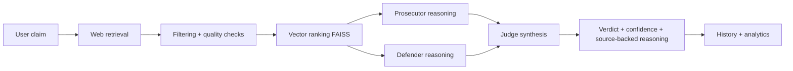
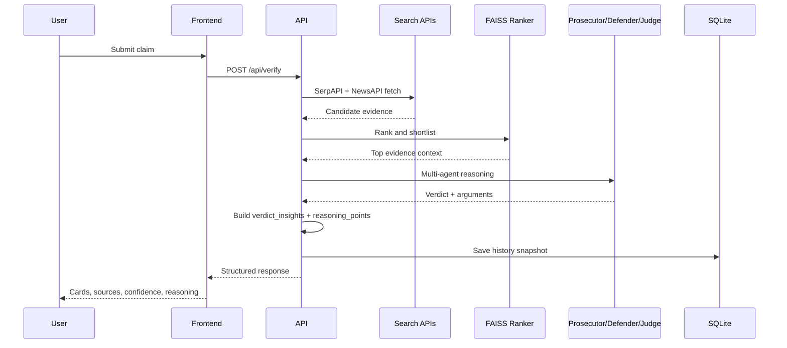

<div align="center">

# VeritasAI

### Fake News ❌ -> Facts ✅

<p>
  
</p>

<p>
  
  
  
  
  
  
</p>

<p>
  
  
  
  
</p>

</div>

---

## Why VeritasAI? 🧠

VeritasAI is an explainable fact-checking workflow that does not just return a label.
It retrieves evidence from the web, compares supportive and contradictory sources, runs prosecutor and defender reasoning, and produces a transparent verdict with confidence and citations.

### Core outcomes

- Evidence-first verification, not blind LLM output
- Multi-agent argument structure for clearer decision trails
- Source-linked reasoning points for both sides
- Fast UI with history replay and cached claim refresh

---

## What Is New (Latest Upgrades) ✨

### Reasoning and verdict quality

- Prosecutor and defender reasoning now includes explicit source references
- Verdict insight block includes:
  - support vs contradict counts
  - top supporting source
  - top contradictory source
  - concise summary of final decision
- Balanced card output: both prosecutor and defender now show minimum multi-point arguments

### Retrieval and ranking

- Increased retrieval breadth from search providers before ranking
- Better support/contradict partitioning before verdict synthesis
- FAISS ranking remains in the loop for top evidence selection

### Frontend UX

- Unified card shadows and visual consistency
- Symmetric hover effects (both-side glow)
- Richer top verdict section (no more empty-looking MISLEADING card)

---

## Product Snapshot 🎯



---

## End-to-End Pipeline ⚙️



---

## Feature Highlights 🛡️

| Area | Capability |
|---|---|
| Evidence | Multi-source retrieval with dedupe and filtering |
| Ranking | FAISS similarity ranking for top context |
| Reasoning | Prosecutor vs Defender source-backed analysis |
| Verdict | TRUE/FALSE/MISLEADING/UNVERIFIED + confidence |
| Explainability | Reasoning points with direct URLs |
| Persistence | Claim history with replay support |
| UI | Animated pipeline, confidence meter, evidence cards |
| Optional graph | Neo4j integration for graph storage |

---

## Project Structure 📁

```text
fake-news-ai/
├── backend/
│   ├── main.py
│   ├── retrieval.py
│   ├── rag.py
│   ├── agents.py
│   ├── graph.py
│   ├── requirements.txt
│   └── rag/
│       ├── vector_store.py
│       ├── embeddings.py
│       ├── evidence_retriever.py
│       └── realtime_fetcher.py
└── frontend/react-app/
    ├── src/
    │   ├── pages/
    │   ├── components/
    │   └── services/
    ├── package.json
    └── vite.config.js
```

---

## Quick Start 🚀

### Backend

```bash
cd fake-news-ai/backend
python3 -m venv .venv
source .venv/bin/activate
pip install -r requirements.txt
python3 -m uvicorn main:app --host 0.0.0.0 --port 8000 --reload
```

### Frontend

```bash
cd fake-news-ai/frontend/react-app
npm install --legacy-peer-deps
npm run dev -- --host 0.0.0.0 --port 5173
```

### Open

- Frontend: http://localhost:5173
- Backend docs: http://localhost:8000/docs

---

## Environment Variables 🔐

Create backend/.env and configure:

```env
GEMINI_API_KEY=your_key
GEMINI_MODEL=gemini-2.5-flash

OLLAMA_URL=http://localhost:11434
OLLAMA_MODEL=llama3.2:1b

NEWSAPI_KEY=your_key
SERPAPI_KEY=your_key

DATABASE_URL=sqlite:///./veritas.db

# Optional
NEO4J_URI=bolt://localhost:7687
NEO4J_USER=neo4j
NEO4J_PASSWORD=password
```

---

## API Endpoints 🧩

- POST /api/verify
- POST /api/verify/quick
- GET /api/claims/history
- GET /api/claims/history/{history_id}
- GET /api/stats
- POST /api/auth/register/
- POST /api/auth/login/
- GET /api/auth/me/

---

## Data and Runtime Files 🗃️

Expected generated files inside backend:

- backend/veritas.db
- backend/veritas_debug.log
- backend/server.log (if redirected)

If duplicates appear at workspace root, they are typically old artifacts and can be cleaned.

---

## Troubleshooting 🛠️

<details>
<summary><b>Backend returns fallback or low-quality output</b></summary>

- Verify API keys in backend/.env
- Check backend/veritas_debug.log
- Confirm internet connectivity for external search APIs

</details>

<details>
<summary><b>Frontend looks stale after backend changes</b></summary>

- Hard refresh browser
- Restart frontend dev server
- Re-run claim to bypass old cached card state

</details>

<details>
<summary><b>Neo4j warnings</b></summary>

Neo4j is optional. The system continues with SQLite and standard retrieval pipeline.

</details>

---

## Roadmap 📌

- Better source reliability scoring per domain family
- Contradiction clustering and duplicate-claim linking
- Claim-type specific templates (health, geopolitics, finance)
- Exportable verification reports

---

## Contributing 🤝

PRs are welcome.

- Keep commits focused
- Test backend API and frontend rendering
- Include sample claim outputs for behavior-changing PRs

---

<div align="center">

### Built for explainable misinformation analysis

If this helped your project, give it a star ⭐

</div>
