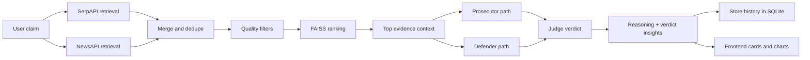
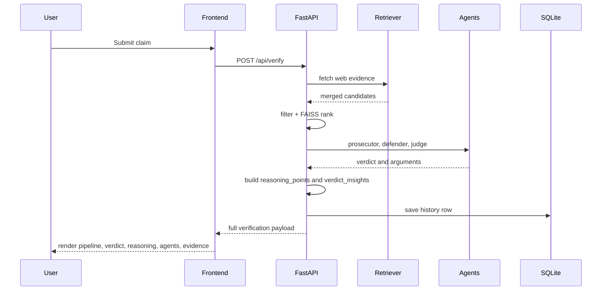
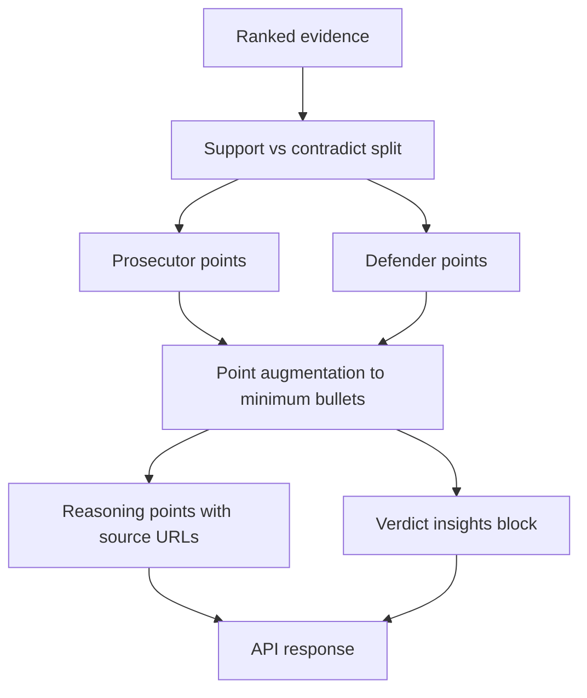

# VeritasAI

VeritasAI is a full-stack claim verification platform that combines retrieval, ranking, and multi-agent reasoning to produce a verdict with confidence, evidence, and explainability.

## What Is New

- Source-backed reasoning points now explicitly show:
  - prosecutor evidence and source URL
  - defender evidence and source URL
  - final decision line
- Verdict insight block now includes:
  - support vs contradict source counts
  - top supporting source
  - top contradictory source
  - short summary
- Balanced agent cards:
  - prosecutor and defender each return at least 3 points to avoid sparse UI cards
- Retrieval breadth increased:
  - SerpAPI and NewsAPI now fetch larger candidate sets before filtering/ranking
- UI polish:
  - all cards use consistent shadow/border style
  - hover effect is centered (both-side glow), not one-sided lift

## Tech Stack

### Backend

- FastAPI
- SQLAlchemy + SQLite
- Gemini and fallback LLM path
- FAISS + sentence-transformers for ranking
- SerpAPI + NewsAPI retrieval
- Optional Neo4j graph store

### Frontend

- React + Vite
- Framer Motion
- React Router
- Chart.js + react-chartjs-2

## Architecture



## Request Lifecycle



## Response Composition



## Run Locally

### 1) Backend

```bash
cd fake-news-ai/backend
python3 -m venv .venv
source .venv/bin/activate
pip install -r requirements.txt
python3 -m uvicorn main:app --host 0.0.0.0 --port 8000 --reload
```

Notes:

- Run from the backend directory to keep SQLite and log files scoped there.
- Avoid using backend/start.sh as-is until import/path issues are corrected.

### 2) Frontend

```bash
cd fake-news-ai/frontend/react-app
npm install --legacy-peer-deps
npm run dev -- --host 0.0.0.0 --port 5173
```

Open:

- Frontend: http://localhost:5173
- Backend docs: http://localhost:8000/docs

## Environment Variables

Create fake-news-ai/backend/.env with keys for your providers.

Typical values:

- GEMINI_API_KEY
- OLLAMA_URL and OLLAMA_MODEL
- NEWSAPI_KEY
- SERPAPI_KEY
- DATABASE_URL (default sqlite:///./veritas.db)
- Optional NEO4J_URI, NEO4J_USER, NEO4J_PASSWORD

## API Endpoints

- POST /api/verify
- POST /api/verify/quick
- GET /api/claims/history
- GET /api/claims/history/{history_id}
- GET /api/stats
- POST /api/auth/register/
- POST /api/auth/login/
- GET /api/auth/me/

## Generated Files And Cleanup

When backend runs from fake-news-ai/backend, these files are expected there:

- backend/veritas.db
- backend/veritas_debug.log
- backend/server.log (if your launch command redirects output)

If you see duplicates in the workspace root, they are usually old artifacts from running commands from the wrong directory and can be deleted safely:

- veritas.db
- veritas_debug.log
- server.log
- temporary root test scripts such as test_ verify.py, test_final.py, tmp_script.py (if you no longer use them)
- root package.json, package-lock.json, node_modules (only needed if you intentionally use root-level Tailwind tooling)

Keep the actual app dependencies and node_modules under:

- fake-news-ai/frontend/react-app

## Troubleshooting

1. Backend returns fallback output

- Check backend logs in backend/veritas_debug.log
- Verify API keys in backend/.env

2. Blank or stale frontend output

- hard refresh browser
- re-run npm run dev in frontend/react-app

3. Neo4j warnings

- Neo4j is optional; app should continue without it

4. Large dependency downloads

- sentence-transformers pulls torch and related binaries; first install can be large
