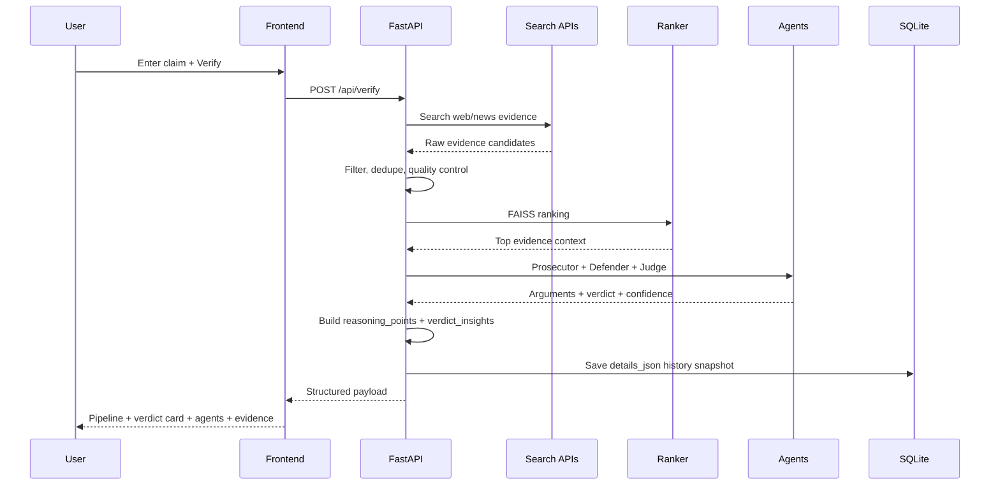
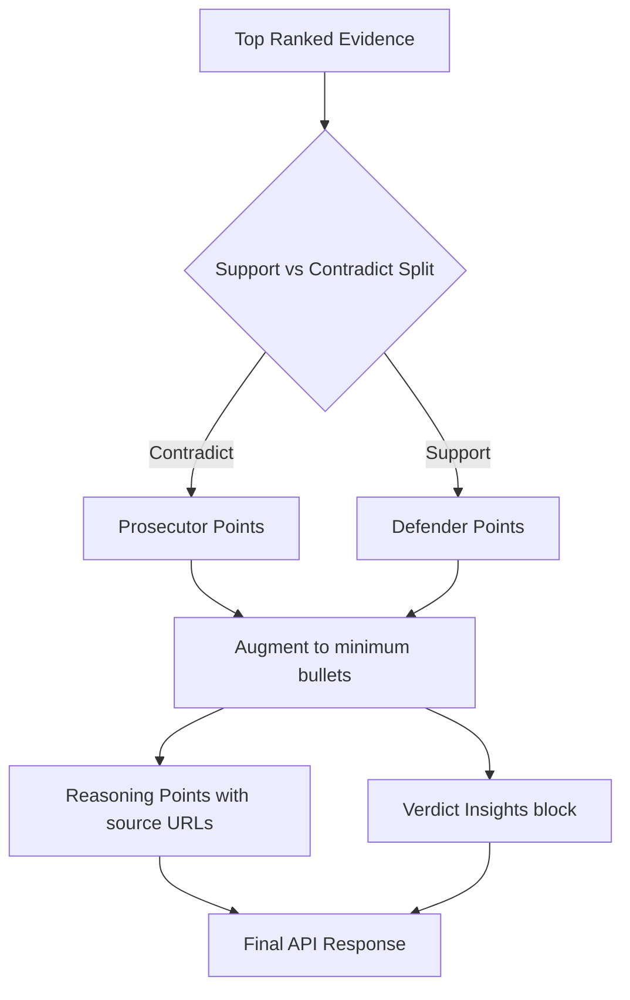

<div align="center">

# VeritasAI

### Fake News ❌ -> Facts ✅

<p>
  
</p>

<p>
  
  
  
  
  
  
</p>

<p>
  
  
  
  
  
</p>

<p>
  
  
  
  
</p>

</div>

---

## Overview 🧠

VeritasAI is a full-stack misinformation verification system that combines retrieval, filtering, ranking, and multi-agent reasoning.
Instead of producing a black-box label, it returns:

- verdict (`TRUE` / `FALSE` / `MISLEADING` / `UNVERIFIED`)
- confidence score
- prosecutor and defender arguments
- source-backed reasoning points
- evidence cards with links
- history snapshots and statistics

### Why this matters

| Problem | Typical tools | VeritasAI approach |
|---|---|---|
| Opaque verdicts | Label only | Label + explicit rationale + source URLs |
| Weak source tracking | Minimal links | Ranked evidence + verdict insights block |
| Unbalanced argument view | One-side summary | Prosecutor vs Defender with balanced points |
| Reproducibility | Hard to replay | History snapshots + claim replay |

---

## Feature Matrix ✨

| Module | Feature | Status | Notes |
|---|---|---|---|
| Retrieval | SerpAPI + NewsAPI fetch | ✅ | Increased breadth before ranking |
| Filtering | self-source + quality filtering | ✅ | Removes noisy/irrelevant evidence |
| Ranking | FAISS semantic shortlist | ✅ | Top context passed to agents |
| Agents | Prosecutor / Defender / Judge | ✅ | Source-backed output formatting |
| Reasoning | Explicit evidence citations | ✅ | Prosecutor + defender + final decision line |
| Verdict Insights | Support vs contradict counts | ✅ | Includes top supporting/contradicting sources |
| Frontend UX | Animated pipeline + cards | ✅ | Symmetric hover glow, stronger card styling |
| Persistence | SQLite claim history | ✅ | Replay historical results on Home |
| Graph Storage | Neo4j integration | Optional | App runs without Neo4j |

---

## New Enhancements (Recent) 🚀

### Backend improvements

- Added source-backed reasoning point generation
- Added verdict insights payload with source counts and top links
- Balanced prosecutor/defender argument lengths to avoid empty card sections
- Increased retrieval breadth to improve evidence diversity

### Frontend improvements

- Richer MISLEADING verdict block with supportive/contradictory insight chips
- Better card consistency and visual hierarchy
- Smooth hover effects from both sides instead of one-sided lift

### Documentation improvements

- Expanded architecture and flow diagrams
- Added runtime file cleanup guidance
- Added endpoint, environment, and troubleshooting tables

---

## Architecture (Color-Coded) 🎨

```mermaid
flowchart LR
    U[User Claim]:::input --> A[Retrieval Layer]:::retrieval
    A --> B[Filter + Dedupe]:::filter
    B --> C[FAISS Ranking]:::rank
    C --> D[Evidence Context]:::context
    D --> P[Prosecutor Agent]:::prosecutor
    D --> F[Defender Agent]:::defender
    P --> J[Judge Agent]:::judge
    F --> J
    J --> V[Verdict + Confidence]:::verdict
    V --> R[Reasoning Points + Insights]:::insights
    R --> DB[(SQLite History)]:::storage
    R --> UI[Frontend Cards]:::ui

    classDef input fill:#0f172a,stroke:#22d3ee,stroke-width:2,color:#e2e8f0;
    classDef retrieval fill:#1d4ed8,stroke:#93c5fd,color:#fff;
    classDef filter fill:#0f766e,stroke:#5eead4,color:#fff;
    classDef rank fill:#6d28d9,stroke:#c4b5fd,color:#fff;
    classDef context fill:#334155,stroke:#94a3b8,color:#fff;
    classDef prosecutor fill:#b91c1c,stroke:#fca5a5,color:#fff;
    classDef defender fill:#065f46,stroke:#86efac,color:#fff;
    classDef judge fill:#92400e,stroke:#fcd34d,color:#fff;
    classDef verdict fill:#9a3412,stroke:#fdba74,color:#fff;
    classDef insights fill:#7e22ce,stroke:#d8b4fe,color:#fff;
    classDef storage fill:#1e293b,stroke:#94a3b8,color:#fff;
    classDef ui fill:#0c4a6e,stroke:#67e8f9,color:#fff;
```



---

## Full Request Journey 🔁



---

## Verdict Logic View ⚖️



---

## UI Panels and Purpose 🖥️

| UI Section | Purpose | Key Data |
|---|---|---|
| Pipeline Execution | Show live verification stages | active step, progress %, status text |
| Verdict Card | Explain final decision quickly | verdict, confidence, support/contradict counts |
| Reasoning Card | Show why verdict was chosen | source-backed reasoning points |
| Prosecutor Card | Evidence against claim | arguments, strongest point, related sources |
| Defender Card | Evidence supporting claim | arguments, strongest point, related sources |
| Evidence Grid | Raw retriever outputs | title, source, snippet, link, credibility |
| History Page | Replay and audit past claims | saved payload + timestamps |

---

## Project Structure 📁

```text
fake-news-ai/
├── backend/
│   ├── main.py
│   ├── retrieval.py
│   ├── filters.py
│   ├── rag.py
│   ├── agents.py
│   ├── graph.py
│   ├── database.py
│   ├── llm_client.py
│   ├── requirements.txt
│   ├── data/
│   └── rag/
│       ├── vector_store.py
│       ├── embeddings.py
│       ├── evidence_retriever.py
│       ├── realtime_fetcher.py
│       └── search_client.py
└── frontend/react-app/
    ├── src/
    │   ├── pages/
    │   ├── components/
    │   ├── services/
    │   └── assets/
    ├── package.json
    └── vite.config.js
```

---

## Quick Start 🚀

### Backend setup

```bash
cd fake-news-ai/backend
python3 -m venv .venv
source .venv/bin/activate
pip install -r requirements.txt
python3 -m uvicorn main:app --host 0.0.0.0 --port 8000 --reload
```

### Frontend setup

```bash
cd fake-news-ai/frontend/react-app
npm install --legacy-peer-deps
npm run dev -- --host 0.0.0.0 --port 5173
```

### Access URLs

| Service | URL |
|---|---|
| Frontend | http://localhost:5173 |
| Backend API docs | http://localhost:8000/docs |
| Backend health | http://localhost:8000/api/health |

---

## Configuration 🔐

Create `backend/.env` with:

```env
# LLM
GEMINI_API_KEY=your_key
GEMINI_MODEL=gemini-2.5-flash
OLLAMA_URL=http://localhost:11434
OLLAMA_MODEL=llama3.2:1b

# Search providers
NEWSAPI_KEY=your_key
SERPAPI_KEY=your_key

# Storage
DATABASE_URL=sqlite:///./veritas.db

# Optional graph
NEO4J_URI=bolt://localhost:7687
NEO4J_USER=neo4j
NEO4J_PASSWORD=password
```

---

## API Surface 🧩

| Method | Endpoint | Description |
|---|---|---|
| POST | /api/verify | Full verification pipeline |
| POST | /api/verify/quick | Quick alias for verify |
| GET | /api/claims/history | Recent claims list |
| GET | /api/claims/history/{history_id} | Detailed stored payload |
| GET | /api/stats | Dashboard metrics |
| POST | /api/auth/register/ | User registration |
| POST | /api/auth/login/ | User login |
| GET | /api/auth/me/ | Current user profile |

---

## Runtime Files and Cleanup 🗃️

Expected files generated in `backend/`:

- `veritas.db`
- `veritas_debug.log`
- `server.log` (only if redirected)

If these appear at workspace root, they are old run artifacts and can be removed safely after confirming you do not need historical data.

---

## Troubleshooting 🛠️

| Issue | Likely Cause | Fix |
|---|---|---|
| UNVERIFIED fallback too often | Missing API keys or search fetch failure | Verify `.env`, check backend logs |
| Sparse card output | Skewed source split | Ensure latest backend is running (balanced points patch) |
| Frontend stale after changes | Browser cache/dev server state | Hard refresh and restart Vite |
| Neo4j connection warnings | Neo4j not running | Ignore (optional) or start Neo4j service |
| Huge pip downloads | torch/sentence-transformers dependencies | Allow first install to complete; consider CPU-only tuning |

---

## Roadmap 📌

- Trust-weighted source scoring by domain and publisher authority
- Contradiction clustering for duplicate narratives
- Claim-type aware judging templates
- Exportable verification reports (PDF/JSON)
- Better multilingual retrieval and reasoning coverage

---

## Contribution Guide 🤝

1. Fork and create a feature branch
2. Keep PRs focused and atomic
3. Include sample claims and expected outputs for behavior changes
4. Verify backend endpoint behavior and frontend rendering before PR

---

<div align="center">

### Built for explainable misinformation analysis ⚡

If this project helps your work, drop a ⭐ and share feedback.

</div>
