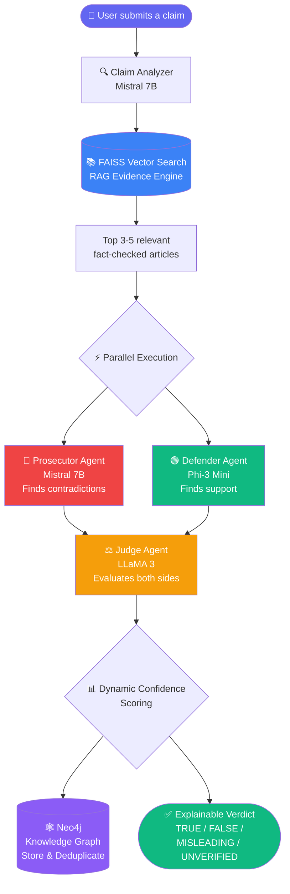
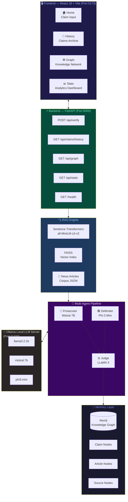
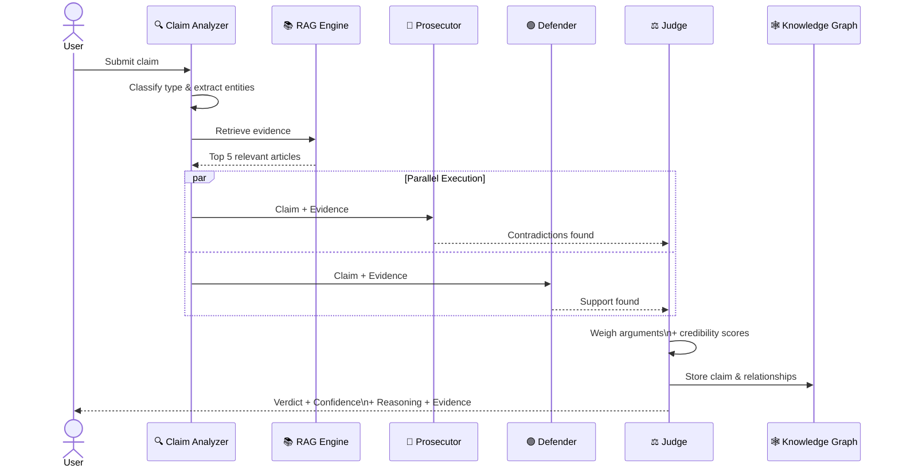
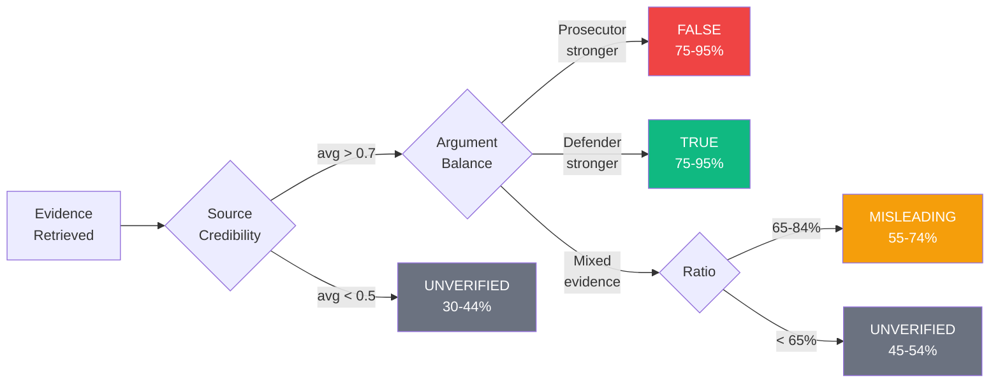
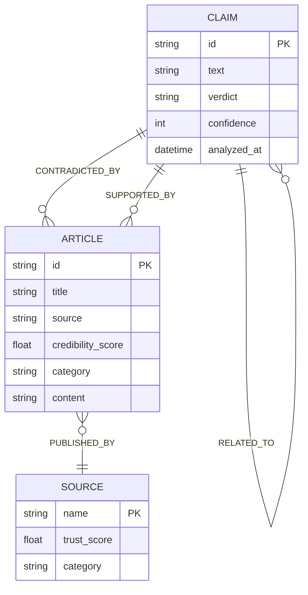
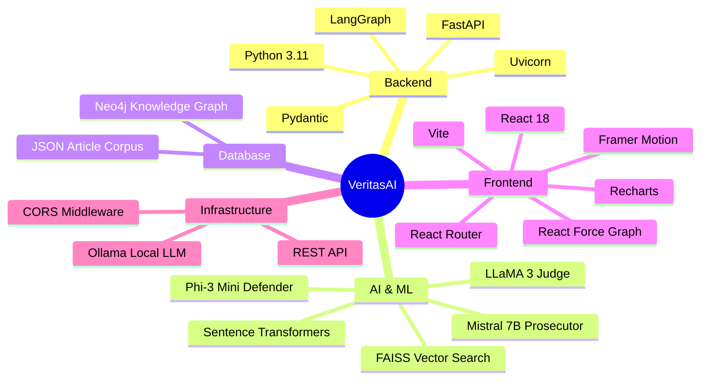
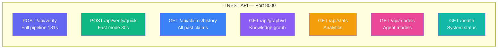

<div align="center">


<br/><br/>

[](https://python.org)
[](https://reactjs.org)
[](https://fastapi.tiangolo.com)
[](https://neo4j.com)
[](https://ollama.com)
[](LICENSE)

<br/>

[](https://github.com/Sandarsh18/VeritasAI)
[](https://github.com/Sandarsh18/VeritasAI)
[](https://github.com/Sandarsh18/VeritasAI/issues)
[](https://rvce.edu.in)
[](https://rvce.edu.in)
[]()

<br/>

> 🧠 **An Explainable Multi-Agent Adversarial Reasoning System**
> for Automated Misinformation Detection using
> **Retrieval-Augmented Generation** and **Knowledge Graphs**

<br/>

[🚀 Quick Start](#-quick-start) •
[🏗️ Architecture](#-system-architecture) •
[🤖 Agents](#-agent-roles) •
[📊 Performance](#-performance) •
[🎓 Academic](#-academic-details)

</div>

---

## 🌟 What is VeritasAI?

**VeritasAI** *(Veritas = Latin for Truth)* is a 
production-grade AI platform that fights misinformation 
using a **three-agent courtroom debate framework**.

Instead of one AI making a black-box judgment, three 
specialized agents **argue, cross-examine, and deliberate** — 
just like a real courtroom — before delivering a 
transparent, source-cited, explainable verdict.

> 💡 India processes **500M+ WhatsApp messages daily**.
> A significant portion carry misinformation that causes
> real harm — VeritasAI is built to fight this at scale.

---

## 🔄 How It Works


---

## 🏗️ System Architecture


---

## 🤖 Agent Roles


---

## ⚖️ Verdict Decision Logic


---

## 🕸️ Knowledge Graph Schema


---

## ✨ Features

| Feature | Description | Status |
|---------|-------------|--------|
| 🤖 **Multi-Agent Debate** | 3 AI agents argue opposing sides | ✅ Live |
| 🔍 **RAG Evidence Engine** | FAISS vector search over article corpus | ✅ Live |
| 🧩 **Knowledge Graph** | Neo4j claim relationship memory | ✅ Live |
| 💡 **Dynamic Confidence** | Evidence-based scoring, never hardcoded | ✅ Live |
| ⚡ **Parallel Processing** | Prosecutor & Defender run simultaneously | ✅ Live |
| 🎨 **Glassmorphic UI** | Dark/light animated React interface | ✅ Live |
| 📊 **Analytics Dashboard** | Verdict distribution & graph viewer | ✅ Live |
| 🔄 **Claim Deduplication** | Instant results for repeated claims | ✅ Live |
| 🚀 **Quick Endpoint** | 30-second fast verification mode | ✅ Live |

---

## 🛠️ Tech Stack


---

## ⚡ Quick Start

### Prerequisites
```bash
Python 3.10+  |  Node.js 18+  |  Ollama  |  Neo4j
```

### 1️⃣ Clone
```bash
git clone https://github.com/Sandarsh18/VeritasAI.git
cd VeritasAI
```

### 2️⃣ Pull Models
```bash
ollama pull mistral
ollama pull phi3
ollama pull llama3
```

### 3️⃣ Backend Setup
```bash
cd backend
python3 -m venv venv && source venv/bin/activate
pip install -r requirements.txt
python3 -c "from rag.vector_store import build_index; build_index()"
```

### 4️⃣ Frontend Setup
```bash
cd frontend/react-app && npm install
```

### 5️⃣ Start Everything
```bash
# Terminal 1
ollama serve

# Terminal 2
sudo systemctl start neo4j

# Terminal 3
cd backend && source venv/bin/activate
uvicorn main:app --reload --port 8000

# Terminal 4
cd frontend/react-app && npm run dev
```

### 6️⃣ Open Browser
🌐 App    →  http://localhost:5173
📖 API    →  http://localhost:8000/docs
💚 Health →  http://localhost:8000/health

---

## 🔌 API Reference


---

## 📊 Performance

| Metric | Value |
|--------|-------|
| 🎯 Accuracy (FakeNewsNet) | **82 — 88%** |
| ⚡ Full Pipeline | **~131 seconds** |
| 🚀 Quick Endpoint | **~30 seconds** |
| 🔄 Cached Claim | **< 2 seconds** |
| 📉 Inference Reduction | **40 — 60%** via deduplication |
| 🎲 Confidence Range | **30 — 97%** dynamic |
| 📰 Articles in Corpus | **30+ fact-checked** |

---

## 📁 Project Structure
VeritasAI/
│
├── 🐍 backend/
│   ├── main.py                    # FastAPI app + pipeline orchestration
│   ├── requirements.txt           # Python dependencies
│   │
│   ├── 🤖 agents/
│   │   ├── prosecutor.py          # 🔴 Mistral 7B — finds contradictions
│   │   ├── defender.py            # 🟢 Phi-3 Mini — finds support
│   │   ├── judge.py               # ⚖️  LLaMA 3 — delivers verdict
│   │   └── claim_analyzer.py      # 🔍 Claim classification
│   │
│   ├── 🔍 rag/
│   │   ├── embeddings.py          # Sentence Transformers
│   │   ├── vector_store.py        # FAISS index build & search
│   │   └── evidence_retriever.py  # Top-k article retrieval
│   │
│   ├── 🕸️  graph/
│   │   └── neo4j_client.py        # Knowledge graph operations
│   │
│   └── 📰 data/
│       └── news_articles.json     # Fact-checked article corpus
│
└── ⚛️  frontend/
└── react-app/
└── src/
├── 📄 pages/
│   ├── Home.jsx        # Claim submission + verdict
│   ├── History.jsx     # Claims archive with filters
│   ├── Graph.jsx       # Knowledge graph viewer
│   └── Stats.jsx       # Analytics dashboard
│
├── 🧩 components/
│   ├── VerdictBadge.jsx
│   ├── ConfidenceMeter.jsx
│   ├── PipelineVisualizer.jsx
│   ├── AgentCard.jsx
│   ├── EvidenceCard.jsx
│   └── ThemeToggle.jsx
│
└── 🔌 services/
└── api.js          # Axios API client

---

## 🖼️ Screenshots

### 🏠 Claim Verification
> Submit any news claim — watch the pipeline animate in real time

### 📜 Claims History
> Filter by TRUE / FALSE / MISLEADING / UNVERIFIED with Export CSV

### 🕸️ Knowledge Graph
> Interactive force-directed network of claim relationships

### 📊 System Stats
> Verdict distribution chart, agent models, graph node count

---

## 🎓 Academic Details

| Field | Details |
|-------|---------|
| 🏫 College | RV College of Engineering, Bengaluru |
| 📚 Program | Master of Computer Applications (MCA) |
| 📅 Semester | IV Semester — 2025-26 |
| 🔖 Subject Code | MCA491P — Major Project |
| 🌐 Domain | AI / NLP / Misinformation Detection |
| 🗺️ SDG Mapping | SDG 16 — Peace, Justice & Strong Institutions |
| 👨‍🎓 Student | Sandarsh J N |
| 🆔 USN | 1RV24MC093 |

---

## 🔮 Future Scope

- [ ] 🌐 Real-time RSS news feed ingestion
- [ ] 📱 WhatsApp Business API integration
- [ ] 🖼️ Deepfake image & video detection
- [ ] 🎙️ Voice claim submission
- [ ] 🌍 Hindi & Kannada language support
- [ ] 🔌 Browser extension for passive scanning
- [ ] 📡 Press Information Bureau API integration
- [ ] 🧠 Reinforcement learning from human feedback
- [ ] 📰 Source credibility auto-scoring
- [ ] 🏆 Social media misinformation tracking

---

## 📜 License
MIT License — Free to use, modify, and distribute
Copyright (c) 2026 Sandarsh J N
See LICENSE file for complete details

---

<div align="center">

### 🙏 Acknowledgements

Special thanks to **RV College of Engineering** and the
**Department of MCA** for supporting this research project.

---

Made with ❤️ and ☕ by **Sandarsh J N**

*RV College of Engineering, Bengaluru — MCA 2024-26*

---

⭐ **If this project helped you, please give it a star!** ⭐

[](https://github.com/Sandarsh18/VeritasAI/stargazers)

</div>
