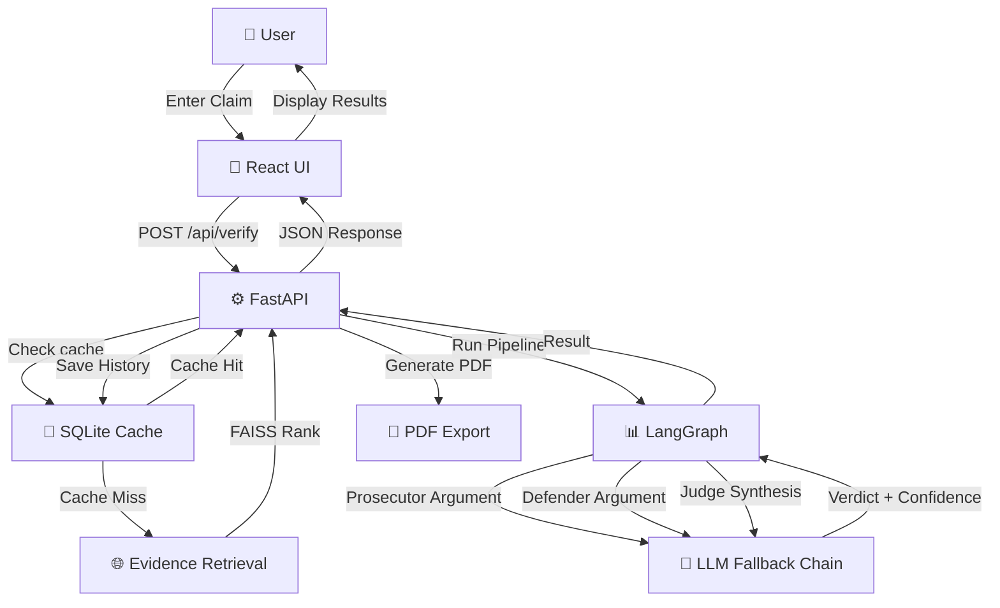
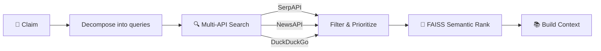
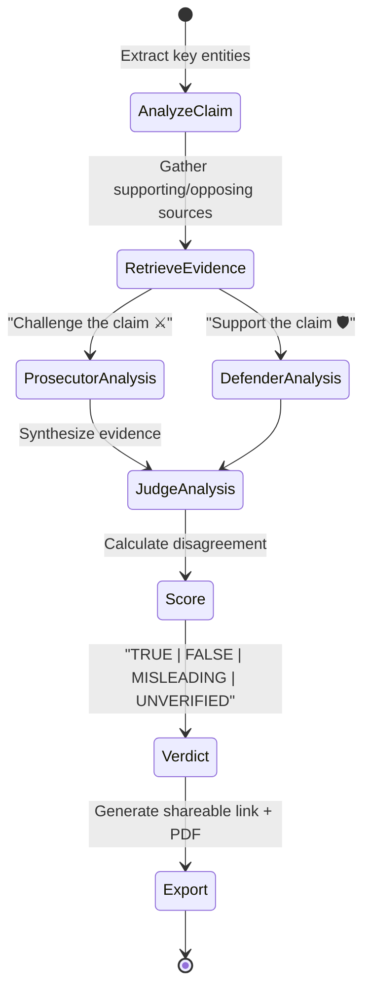
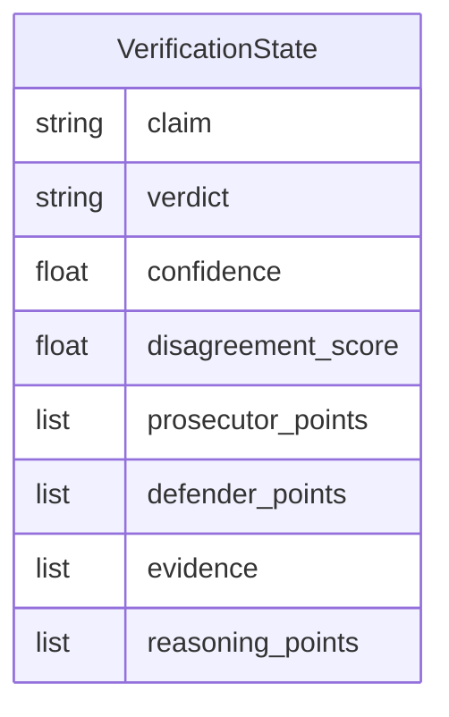

<div align="center">

# VeritasAI 🔎🧠⚖️

### Explainable Fact-Checking Through Multi-Agent Reasoning

<p>
  
</p>

<p>
  
  
  
  
  
  
</p>

<p>
  
  
  
  
  
</p>

</div>

---

## 📋 Table of Contents

- [What is VeritasAI?](#what-is-veritasai)
- [Key Features](#key-features)
- [System Architecture](#system-architecture)
- [How It Works](#how-it-works)
- [Tech Stack](#tech-stack)
- [Installation](#installation)
- [Configuration](#configuration)
- [API Reference](#api-reference)
- [Project Structure](#project-structure)
- [Development](#development)
- [Performance](#performance)
- [Contributing](#contributing)
- [License](#license)

---

## What is VeritasAI?

VeritasAI is an **explainable claim verification platform** that analyzes misinformation through multi-agent debate and evidence-based reasoning. Instead of providing a black-box verdict, it:

1. **Retrieves evidence** from multiple web sources using a hybrid RAG pipeline
2. **Generates arguments** through competing AI agents (Prosecutor 🔨 and Defender 🛡️)
3. **Synthesizes verdicts** via a Judge agent that weighs both sides
4. **Scores disagreement** to measure claim contentiousness
5. **Exports results** as shareable links, PDFs, and historical records

Perfect for journalists, researchers, and fact-checkers who need **transparency, not just accuracy**.

---

## 🚀 Key Features

### Core Capabilities
- ✅ **Agentic Multi-Agent Verification** — LangGraph-orchestrated Prosecutor/Defender/Judge debate system
- ✅ **RAG-Powered Evidence Retrieval** — FAISS semantic ranking + multi-API fallback (SerpAPI, NewsAPI, DuckDuckGo)
- ✅ **Disagreement Scoring** — Quantifies claim contentiousness and agent consensus
- ✅ **Batch Verification** — Process up to 5 claims concurrently
- ✅ **Confidence Scoring** — Normalized 0-100 confidence with reasoning
- ✅ **Source Attribution** — Evidence cards with domain credibility scores

### User Features
- ✅ **Claim History** — Persistent SQLite-backed verification history
- ✅ **Shareable Links** — Short IDs for public claim sharing
- ✅ **PDF Export** — Professional verdict reports with evidence summaries
- ✅ **JWT Authentication** — Secure user registration and login
- ✅ **Real-Time Pipeline Visualization** — See each reasoning stage as it executes
- ✅ **Responsive UI** — Modern React 19 + Vite frontend with animations

### Reliability
- ✅ **Multi-LLM Fallback Chain** — Gemini → Groq → DeepSeek → Ollama
- ✅ **Semantic Caching** — Skip re-processing identical claims
- ✅ **API Resilience** — Graceful degradation when external APIs fail
- ✅ **Health Checks** — Real-time service and LLM provider status

---

## 🏗️ System Architecture

### High-Level Request Flow



### Evidence Retrieval & Ranking Pipeline



### Multi-Agent Verification Workflow



### LangGraph State Management

The pipeline uses `VerificationState` (Pydantic model) flowing through LangGraph nodes:



---

## 🧭 How It Works

### 1. Claim Submission
User enters a claim via the React UI. The claim is tokenized into searchable sub-queries.

### 2. Evidence Gathering (RAG Pipeline)
- **Query Decomposition** → Break claim into sub-questions
- **Multi-Source Retrieval** → Search SerpAPI, NewsAPI, DuckDuckGo in parallel
- **Relevance Filtering** → Remove off-topic and low-quality sources
- **FAISS Ranking** → Semantic ranking based on embedding similarity
- **Source Credibility** → Domain reputation scores

### 3. Prosecutor Analysis (Agent 1)
The Prosecutor agent:
- Identifies weaknesses in the claim
- Finds contradicting evidence
- Generates structured counter-arguments
- Assigns strength score: `weak | medium | strong`

### 4. Defender Analysis (Agent 2)
The Defender agent:
- Identifies strengths in the claim
- Finds supporting evidence
- Generates structured pro-arguments
- Assigns strength score: `weak | medium | strong`

### 5. Judge Synthesis (Agent 3)
The Judge agent:
- Reviews both prosecutor and defender cases
- Weights evidence credibility
- Produces final verdict: `TRUE | FALSE | MISLEADING | UNVERIFIED | INSUFFICIENT_DATA`
- Assigns confidence: `0-100` (normalized)
- Generates structured reasoning with citations

### 6. Disagreement Scoring
- Compares Prosecutor and Defender argument strengths
- Returns `disagreement_score: 0.0-1.0`
  - `0.0` = Strong consensus
  - `1.0` = Maximum disagreement
- Labels as `Low | Medium | High` contentiousness

### 7. Result Persistence
- Save to SQLite cache (keyed by claim hash)
- Generate short ID for sharing
- Create verifiable history record
- (Optional) Store to Neo4j knowledge graph

---

## 🛠️ Tech Stack

### Frontend

| Technology | Purpose |
|---|---|
| **React 19** | Interactive component framework |
| **Vite 5** | Lightning-fast dev server & build |
| **React Router 7** | Client-side navigation |
| **Axios** | HTTP client for API calls |
| **Framer Motion** | Smooth animations & transitions |
| **Chart.js** | Analytics dashboard charts |
| **Lucide React** | Beautiful icon library |
| **Tailwind CSS** | Utility-first styling |

### Backend

| Technology | Purpose |
|---|---|
| **FastAPI 0.111** | High-performance async REST API |
| **SQLAlchemy 2.0** | ORM for database operations |
| **SQLite** | Local persistent database |
| **LangGraph 0.2.66** | Agent orchestration & state management |
| **Pydantic** | Data validation & serialization |
| **JWT + bcrypt** | Secure authentication |

### AI/ML & Data

| Technology | Purpose |
|---|---|
| **LangChain** | LLM and agent utilities |
| **FAISS** | Vector similarity search & ranking |
| **Sentence-Transformers** | Semantic embeddings |
| **SerpAPI** | Google Search integration |
| **NewsAPI** | News articles retrieval |
| **DuckDuckGo Search** | Privacy-respecting web search |

### LLM Providers (Fallback Chain)

| Provider | Model | Purpose |
|---|---|---|
| **Google Gemini** | 2.5-flash | Primary fast reasoning |
| **Groq** | llama-3.3-70b | High-quality analysis |
| **DeepSeek** | reasoner | Extended reasoning |
| **Ollama** | llama3.2 | Local fallback inference |

### Export & Utilities

| Technology | Purpose |
|---|---|
| **ReportLab** | PDF generation |
| **FeedParser** | RSS/feed parsing |
| **Beautiful Soup 4** | HTML parsing |

---

## 📦 Installation

### Prerequisites

- **Python** 3.10 or higher
- **Node.js** 18+ and npm 9+
- **Optional:** Ollama runtime for local LLM fallback
- **Optional:** Neo4j server for knowledge graph features

### Backend Setup

```bash
# Navigate to backend directory
cd fake-news-ai/backend

# Create virtual environment
python3 -m venv venv

# Activate virtual environment
# On macOS/Linux:
source venv/bin/activate
# On Windows (PowerShell):
# venv\Scripts\Activate.ps1

# Install dependencies
pip install -r requirements.txt

# Start backend server
uvicorn main:app --host 0.0.0.0 --port 8000 --reload
```

**Verify backend is running:**
```bash
curl http://localhost:8000/api/health
```

### Frontend Setup

```bash
# Navigate to frontend directory
cd fake-news-ai/frontend/react-app

# Install dependencies
npm install --legacy-peer-deps

# Start development server
npm run dev -- --host 0.0.0.0 --port 5173
```

**Open frontend:**
- Frontend UI: http://localhost:5173
- Backend API: http://localhost:8000

### Optional: Ollama Setup

For local LLM fallback (recommended for development):

```bash
# Download and start Ollama
# See: https://ollama.ai

# In a separate terminal, ensure Ollama is running:
ollama serve

# Pull a model (default is llama3.2):
ollama pull llama3.2:1b
```

---

## 🔐 Configuration

### Environment Variables

Create `backend/.env` file:

```env
# ═══════════════════════════════════════════════════════════════
# SECURITY & CORE
# ═══════════════════════════════════════════════════════════════
SECRET_KEY=your-secret-key-here-min-32-chars
CORS_ORIGINS=http://localhost:5173,http://127.0.0.1:5173

# ═══════════════════════════════════════════════════════════════
# DATABASE
# ═══════════════════════════════════════════════════════════════
DATABASE_URL=sqlite:///./veritas.db

# ═══════════════════════════════════════════════════════════════
# SEARCH APIs
# ═══════════════════════════════════════════════════════════════
NEWSAPI_KEY=your-newsapi-key
SERPAPI_KEY=your-serpapi-key

# ═══════════════════════════════════════════════════════════════
# LLM PROVIDERS (Prosecutor, Defender, Judge)
# ═══════════════════════════════════════════════════════════════

# Google Gemini (Primary)
GEMINI_API_KEY=your-gemini-api-key
GEMINI_MODEL=gemini-2.5-flash

# Groq (Secondary)
GROQ_API_KEY=your-groq-api-key
GROQ_DEFENDER_MODEL=llama-3.1-8b-instant
GROQ_JUDGE_MODEL=llama-3.3-70b-versatile

# DeepSeek (Tertiary)
DEEPSEEK_API_KEY=your-deepseek-api-key
DEEPSEEK_BASE_URL=https://api.deepseek.com
DEEPSEEK_MODEL=deepseek-reasoner

# Ollama (Fallback - Local)
OLLAMA_BASE_URL=http://localhost:11434
OLLAMA_ANALYZER_MODEL=llama3.2:1b
OLLAMA_MODEL=mistral:latest

# ═══════════════════════════════════════════════════════════════
# OPTIONAL: Neo4j Knowledge Graph
# ═══════════════════════════════════════════════════════════════
NEO4J_URI=bolt://localhost:7687
NEO4J_USER=neo4j
NEO4J_PASSWORD=your-neo4j-password
```

### Getting API Keys

| Service | Free Tier | Link |
|---|---|---|
| **SerpAPI** | 100 req/month | [serpapi.com](https://serpapi.com) |
| **NewsAPI** | 100 req/day | [newsapi.org](https://newsapi.org) |
| **Google Gemini** | 60 req/min | [ai.google.dev](https://ai.google.dev) |
| **Groq** | 7500 req/day | [groq.com](https://groq.com) |
| **DeepSeek** | $5 free credit | [platform.deepseek.com](https://platform.deepseek.com) |

---

## 📡 API Reference

### Verification Endpoints

#### POST `/api/verify`
Verify a single claim with full multi-agent pipeline.

**Request:**
```json
{
  "claim": "The Earth orbits the Sun"
}
```

**Response:**
```json
{
  "success": true,
  "claim": "The Earth orbits the Sun",
  "verdict": "TRUE",
  "confidence": 98,
  "disagreement_score": 0.05,
  "contentiousness": "Low",
  "reasoning": "Scientific consensus...",
  "prosecutor_analysis": {
    "arguments": ["..."],
    "strength": "weak"
  },
  "defender_analysis": {
    "arguments": ["..."],
    "strength": "strong"
  },
  "evidence": [
    {
      "title": "Earth's Orbit",
      "url": "https://example.com",
      "domain": "nasa.gov",
      "snippet": "...",
      "relevance_score": 0.95
    }
  ],
  "history_id": "12345",
  "short_id": "abc123",
  "cache_hit": false,
  "processing_time_seconds": 45.23
}
```

#### POST `/api/verify/batch`
Verify up to 5 claims concurrently.

**Request:**
```json
{
  "claims": [
    "Claim 1",
    "Claim 2",
    "Claim 3"
  ]
}
```

**Response:**
```json
{
  "results": [
    { /* verify response */ },
    { /* verify response */ },
    { /* verify response */ }
  ],
  "total_time_seconds": 120.5
}
```

#### POST `/api/verify/quick`
Quick verification wrapper around `/verify`.

---

### History & Sharing

#### GET `/api/claims/history`
Retrieve user's claim verification history.

**Response:**
```json
{
  "claims": [
    {
      "id": 1,
      "claim": "Sample claim",
      "verdict": "TRUE",
      "confidence": 85,
      "timestamp": "2026-05-11T10:30:00Z",
      "short_id": "abc123"
    }
  ],
  "is_authenticated": true,
  "total": 42
}
```

#### GET `/api/claims/history/{history_id}`
Retrieve detailed verification snapshot.

#### GET|HEAD `/api/export/pdf/{history_id}`
Download PDF report for a verification.

**Example:**
```bash
curl -o verdict.pdf http://localhost:8000/api/export/pdf/12345
```

#### GET `/api/share/{short_id}`
Public view of a shared verification (no auth required).

---

### Authentication

#### POST `/api/auth/register`
Register new user.

**Request:**
```json
{
  "username": "johndoe",
  "email": "john@example.com",
  "password": "securepassword123"
}
```

#### POST `/api/auth/login`
Login user.

**Request:**
```json
{
  "username": "johndoe",
  "password": "securepassword123"
}
```

**Response:**
```json
{
  "access_token": "eyJ0eXAiOiJKV1QiLCJhbGc...",
  "token_type": "bearer",
  "user": {
    "id": 1,
    "username": "johndoe",
    "email": "john@example.com"
  }
}
```

#### GET `/api/auth/me`
Get current authenticated user.

#### GET `/api/auth/check-username`
Check username availability.

#### GET `/api/auth/check-email`
Check email availability.

---

### Utility Endpoints

| Endpoint | Method | Description |
|---|---|---|
| `/api/health` | GET | Service health + LLM provider status |
| `/api/stats` | GET | Aggregate verification statistics |
| `/api/trending` | GET | Top trending claims being verified |
| `/api/sources` | GET | Supported evidence sources metadata |

---

## 📁 Project Structure

```
fake-news-ai/
├── README.md                          # This file
├── PROJECT_SETUP_GUIDE.md            # Detailed setup guide
├── .github/
│   └── workflows/
│       └── secret-scan.yml           # GitHub Actions CI/CD
├── .gitleaks.toml                    # Secret scanning config
├── .pre-commit-config.yaml           # Pre-commit hooks
│
├── backend/
│   ├── main.py                       # FastAPI app + route handlers
│   ├── agents.py                     # LangGraph orchestrator
│   ├── state.py                      # VerificationState definition
│   ├── rag_core.py                   # RAG pipeline (FAISS ranking)
│   ├── retrieval.py                  # Multi-source evidence retrieval
│   ├── filters.py                    # Source quality filters
│   ├── credibility.py                # Domain credibility scoring
│   ├── database.py                   # SQLAlchemy models + ORM
│   ├── auth.py                       # JWT authentication logic
│   ├── pdf_export.py                 # ReportLab PDF generation
│   ├── llm_client.py                 # Multi-LLM fallback chain
│   ├── gemini_client.py              # Gemini-specific client
│   │
│   ├── agents/
│   │   ├── claim_analyzer.py         # Entity extraction + analysis
│   │   ├── prosecutor.py             # Prosecutor agent
│   │   ├── defender.py               # Defender agent
│   │   ├── judge.py                  # Judge agent (verdict synthesis)
│   │   └── source_tracker.py         # Evidence attribution
│   │
│   ├── rag/
│   │   ├── embeddings.py             # Sentence transformer wrappers
│   │   ├── faiss_store.py            # FAISS vector store
│   │   ├── retriever.py              # RAG retriever interface
│   │   ├── knowledge_base.py         # Knowledge base indexing
│   │   └── realtime_fetcher.py       # Real-time source fetching
│   │
│   ├── services/
│   │   ├── cache_service.py          # Semantic caching
│   │   ├── credibility_service.py    # Credibility scoring
│   │   ├── evidence_classifier.py    # Evidence categorization
│   │   ├── metrics_service.py        # Analytics/metrics
│   │   ├── ranking_service.py        # Evidence ranking utilities
│   │   └── llm_client.py             # LLM provider integration
│   │
│   ├── tests/
│   │   ├── conftest.py               # pytest configuration
│   │   ├── test_gemini.py            # Gemini integration tests
│   │   ├── test_pipeline_recovery.py # Fallback mechanism tests
│   │   ├── test_retriever_*.py       # RAG pipeline tests
│   │   └── test_search_apis.py       # Search API tests
│   │
│   ├── data/
│   │   ├── news_articles.json        # Sample dataset
│   │   └── faiss_vectors.npy         # Pre-computed embeddings
│   │
│   ├── requirements.txt              # Python dependencies
│   ├── .env.example                  # Environment variable template
│   ├── start.sh                      # Backend startup script
│   └── veritas.db                    # SQLite database (auto-created)
│
└── frontend/react-app/
    ├── package.json                  # Node dependencies
    ├── vite.config.js               # Vite build configuration
    ├── eslint.config.js             # Linting rules
    │
    ├── src/
    │   ├── main.jsx                 # App entry point
    │   ├── App.jsx                  # Root component
    │   ├── App.css                  # Global styles
    │   │
    │   ├── pages/
    │   │   ├── Home.jsx             # Main verification workflow
    │   │   ├── History.jsx          # Claim history + replay
    │   │   ├── Stats.jsx            # Analytics dashboard
    │   │   ├── Login.jsx            # User login
    │   │   ├── Register.jsx         # User registration
    │   │   └── Profile.jsx          # User profile
    │   │
    │   ├── components/
    │   │   ├── AgentCard.jsx        # Prosecutor/Defender card
    │   │   ├── EvidenceCard.jsx     # Evidence item display
    │   │   ├── ConfidenceGauge.jsx  # Confidence meter
    │   │   ├── VerdictBadge.jsx     # Verdict display badge
    │   │   ├── PipelineProgress.jsx # Real-time pipeline stages
    │   │   ├── SkeletonLoader.jsx   # Loading placeholder
    │   │   └── MetricsPanel.jsx     # Statistics panel
    │   │
    │   ├── hooks/
    │   │   └── useVoice.js          # Voice input/output (optional)
    │   │
    │   ├── services/
    │   │   └── api.js               # Axios API client
    │   │
    │   ├── lib/
    │   │   └── utils.ts             # Utility functions
    │   │
    │   └── assets/                  # Images, logos, icons
    │
    ├── public/                       # Static assets
    ├── start.sh                      # Frontend startup script
    └── index.html                    # HTML entry point
```

---

## 🚀 Development

### Running Both Services Locally

**Terminal 1 — Backend:**
```bash
cd fake-news-ai/backend
source venv/bin/activate
python3 -m uvicorn main:app --reload --port 8000
```

**Terminal 2 — Frontend:**
```bash
cd fake-news-ai/frontend/react-app
npm run dev -- --host 0.0.0.0 --port 5173
```

**Terminal 3 — Ollama (optional):**
```bash
ollama serve
```

### Building for Production

**Backend:**
```bash
# Create optimized build
cd backend
python3 -m uvicorn main:app --host 0.0.0.0 --port 8000
```

**Frontend:**
```bash
cd frontend/react-app
npm run build   # Creates dist/ folder
npm run preview # Preview production build locally
```

### Testing

**Backend Tests:**
```bash
cd backend
pytest tests/ -v
```

**Frontend Build Check:**
```bash
cd frontend/react-app
npm run lint
npm run build
```

### Code Quality

**Pre-commit Hooks (Secret Scanning):**
```bash
# Install pre-commit
pip install pre-commit

# Setup git hooks
pre-commit install

# Run gitleaks scan
pre-commit run gitleaks --all-files
```

---

## ⚡ Performance

### Benchmarks (CPU-Only Inference, Ollama)

| Stage | Duration | Notes |
|---|---|---|
| Claim Analysis | 5-10s | Entity extraction + decomposition |
| Evidence Retrieval | 8-15s | Multi-API search + FAISS ranking |
| Prosecutor Agent | 60-90s | Argument generation |
| Defender Agent | 60-90s | Argument generation |
| Judge Agent | 90-120s | Verdict synthesis |
| **Total Pipeline** | **220-325s** | Full end-to-end processing |

**Optimization Strategies:**
- ✅ Semantic caching (skip re-processing identical claims)
- ✅ Parallel evidence retrieval across APIs
- ✅ FAISS indexing for fast semantic search
- ✅ Frontend request timeout: 600s (10 minutes)
- ✅ LLM context window limits to prevent slowdown
- ✅ Keep-alive settings on Ollama for warm model state

### Fallback Chain Behavior

If primary LLM fails:

1. **Gemini** (primary) → timeout
2. **Groq** (secondary) → timeout
3. **DeepSeek** (tertiary) → timeout
4. **Ollama** (local fallback) → use local inference
5. **Deterministic** → return structured placeholder verdict

API remains responsive even when external services degrade.

---

## 🛡️ Security & Privacy

### Authentication
- JWT-based stateless auth
- bcrypt password hashing
- Secure token expiration

### Data Privacy
- Local SQLite storage (no cloud transmission)
- Optional Neo4j isolation
- CORS restrictions (configurable)

### Secret Management
- `.env` files (ignored in version control)
- GitHub Actions secret scanning (gitleaks)
- Pre-commit hooks for leak prevention

### API Security
- HTTPS support (production deployment)
- Rate limiting (configurable)
- Input validation via Pydantic

---

## 📊 Known Limitations

- **LLM Quality**: Output quality depends on underlying model accuracy
- **News Freshness**: Evidence lags for breaking/recent events
- **Source Bias**: Retrieval APIs may reflect source-specific biases
- **Nuance Loss**: Complex claims may be oversimplified
- **Cache Divergence**: Frontend and backend caches can temporarily differ

---

## 🚦 Troubleshooting

### Backend Issues

#### `ModuleNotFoundError: No module named 'langgraph'`
```bash
# Reinstall dependencies
cd backend
pip install --upgrade -r requirements.txt
```

#### Ollama Connection Refused
```bash
# Ensure Ollama is running in a separate terminal
ollama serve

# Check Ollama is accessible
curl http://localhost:11434/api/version
```

#### Database Lock Error
```bash
# SQLite file may be locked; restart backend
pkill -f "uvicorn main:app"
rm backend/veritas.db  # optional, resets state
# Restart backend
```

### Frontend Issues

#### npm install fails with peer dependency warnings
```bash
npm install --legacy-peer-deps
```

#### Port 5173 already in use
```bash
# Kill existing process or use different port
npm run dev -- --port 5174
```

### API Issues

#### `/api/verify` timeout after 600s
- Ollama model is cold-starting; wait for first request to complete
- Check LLM provider keys are valid (Gemini, Groq, DeepSeek)
- Verify internet connection for evidence retrieval

---

## 🤝 Contributing

### Code of Conduct
Be respectful, inclusive, and constructive in all interactions.

### Development Workflow

1. **Fork** the repository
2. **Create** a feature branch: `git checkout -b feature/my-feature`
3. **Commit** with clear messages: `git commit -m "Add feature X"`
4. **Run tests**: `pytest tests/` or `npm run lint`
5. **Push** to your fork
6. **Open** a Pull Request with description

### Reporting Bugs
- Use GitHub Issues
- Include: Python/Node version, environment, reproduction steps, error logs
- Attach relevant code snippets

### Suggesting Features
- Open a GitHub Discussion
- Explain use case and expected behavior
- Reference related issues

### Code Standards
- **Python**: PEP 8 (via pylint/flake8)
- **JavaScript**: ESLint with React rules
- **Commits**: Clear, descriptive messages
- **Documentation**: Docstrings and comments for complex logic

---

## 📄 License

This project is provided as-is for educational and research purposes.

---

## 🙏 Acknowledgments

Built with:
- **LangGraph** for agent orchestration
- **FastAPI** for REST API
- **React + Vite** for frontend
- **FAISS** for vector search
- **LLM Providers** (Gemini, Groq, DeepSeek)

---

## 📮 Support

- **Issues**: [GitHub Issues](../../issues)
- **Discussions**: [GitHub Discussions](../../discussions)
- **Documentation**: See [PROJECT_SETUP_GUIDE.md](PROJECT_SETUP_GUIDE.md) for detailed setup

---

<div align="center">

**Made with ❤️ for transparent, explainable AI fact-checking**

[⬆ Back to top](#veritasai-)

</div>
